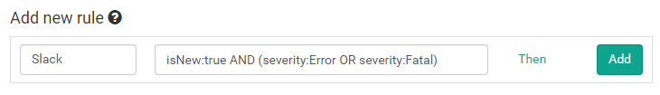
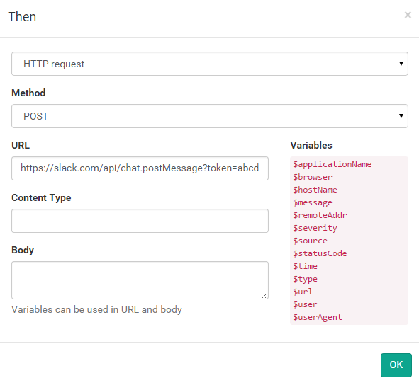

# Integrate with Slack

Start by copying your Slack-token from the [API page](https://api.slack.com/web). We will need this when setting up the integration.

On elmah.io, go to the Rules tab beneath your log settings. In this example we want a message on Slack every time a new error is logged in our elmah.io log. To do this, name your rule and input a query like illustrated on the following screenshot:

Hit the Then link and select HTTP request. Input the following values (remember to replace YOUR_TOKEN and YOUR_CHANNEL):

| Field | Value |
| :--- | :--- |
| Method | POST |
| URL | https://slack.com/api/chat.postMessage?token=YOUR_TOKEN&channel=YOUR_CHANNEL&text=$message&username=elmah.io |

The final result should look like this:

Click the OK button and add the new rule by clicking Add. This configuration tells elmah.io, to make a HTTP request against the Slack API, every time a new error is logged. The message at elmah.io is shown as the chat message inside Slack:

