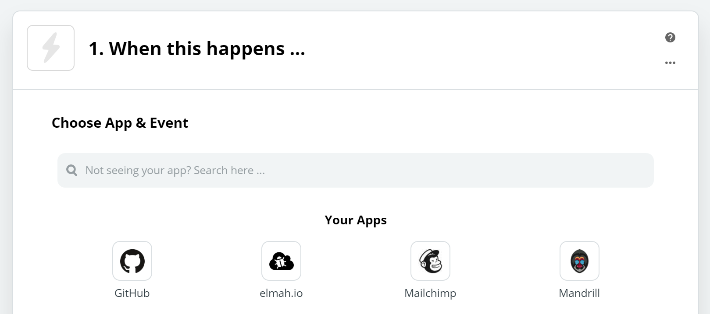
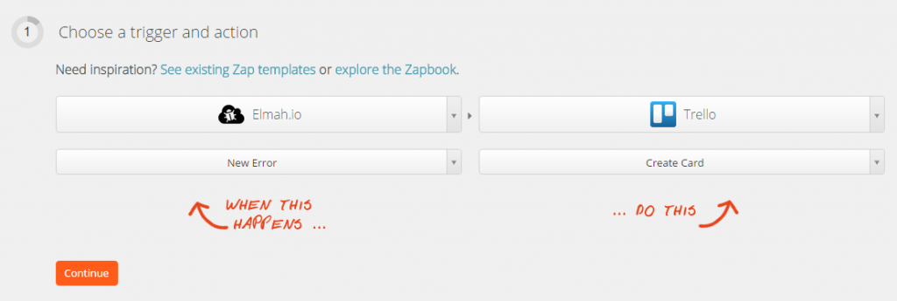
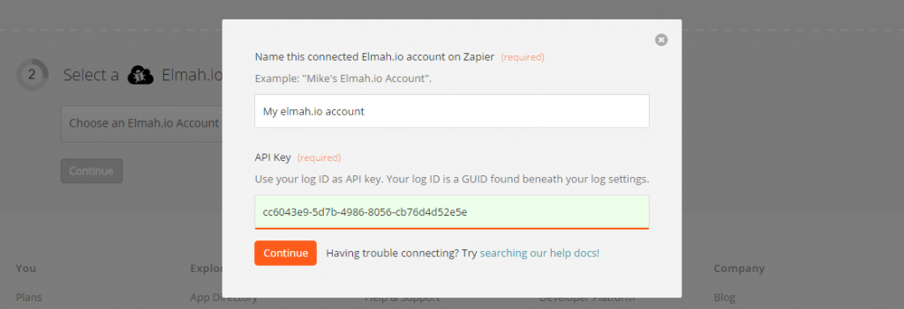
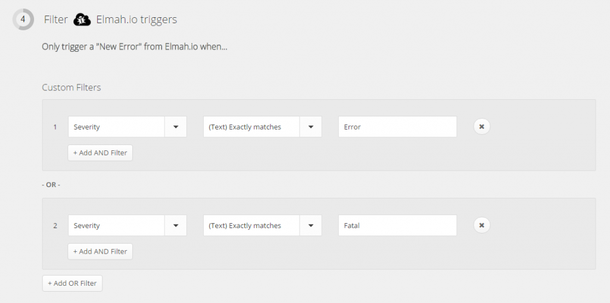
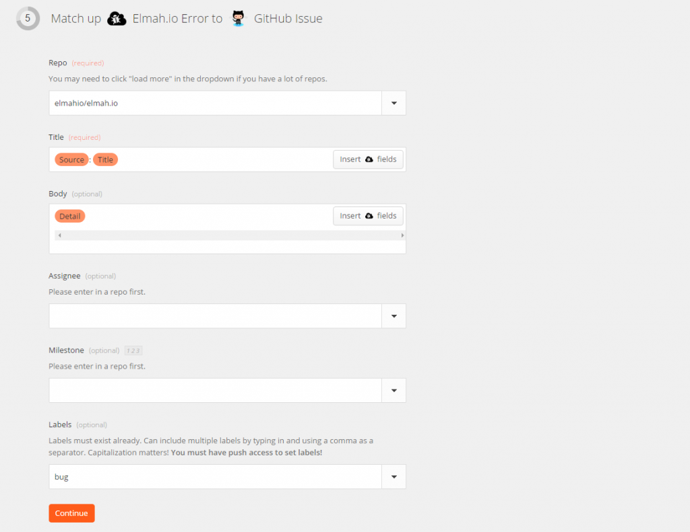
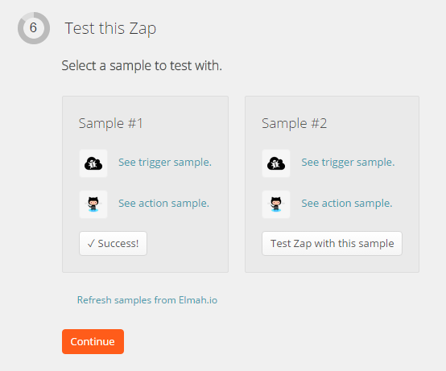
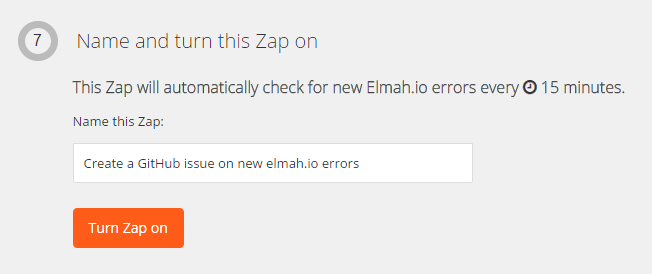

In short Zapier is the place to go, if you need to integrate two or more online systems. In this article we use an integration point provided by elmah.io and Zapier called a trigger. A trigger is (as the name suggest) something that triggers an action in Zapier. In case of elmah.io, the trigger available is when new messages are logged to your log. Actions exists on the other side of the integration and tells Zapier what to do every time a trigger is fired. Hundreds of actions exists, in this example we use the GitHub action to create a new issue every time a new message is logged.

Create a new account on Zapier.com. Then click the Make a New Zap button. The create new Zap page is shown:



Select elmah.io in the _Choose a Trigger app…_ dropdown and then select _New Error_ in the _Choose a Trigger…_ dropdown. In the _Choose an Action app…_ select _GitHub_ and select _Create Issue_ in the _Choose an Action…_ dropdown.



This configuration tells Zapier to create a new issue at GitHub, every time a new error is logged in elmah.io. The action could be one of the hundreds of other integrations available at Zapier. Click Continue.

In section 2 select the _Connect a different elmah.io Account_ and input a name and the log id of the log you want to integrate:



Authorize your GitHub account (or whatever integration you’ve selected in the action step) and click _Continue_. Step 4 isn’t mandatory, but here you will be able to setup additional constraints to the Zap. If you’re using elmah.io for other than errors, you can tell Zapier only to create a new GitHub issue when the message is an actual error:



In step 5 you specify how the new issue should create created. In this example I’ve chosen the GitHub project for our open source client. For the title, I use two of the variables available from the elmah.io action. For a complete list of variables, click the Insert button next to each textbox. The variable will look something like this “MyApp: An error occurred”. The issue body contains the detail of the error (typically a stacktrace). Finally I’ve selected _bug_ as a label.



Test the Zap an hit _Continue_:



Finally, name your Zap and click the _Turn Zap on_ button:



When future errors are logged in your elmah.io log, a GitHub issue is automatically created. How awesome is that!

