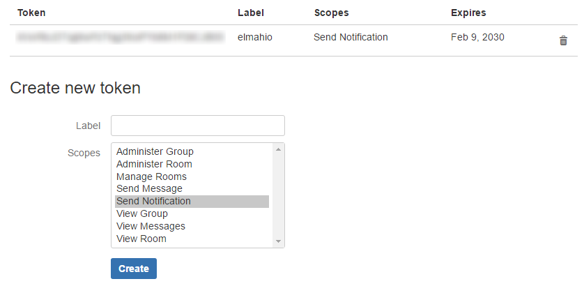
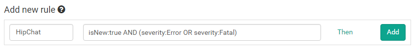
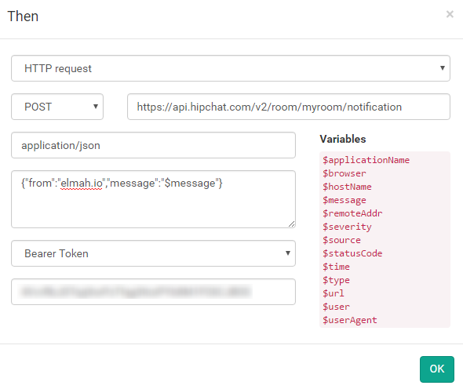
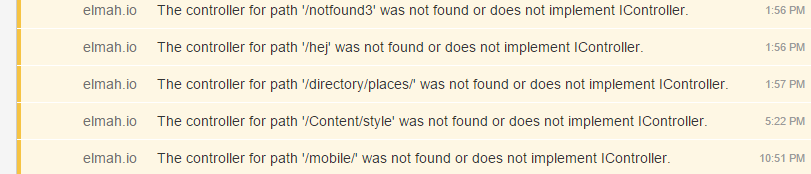

# Integrate with HipChat

Before we dig into the details of elmah.io, you should sign up or log into HipChat. Create a new room for your team and go to the API page. Create a new token with the Notification type and label it something meaningful:

We will need the generated token in a minute, so keep that tab open.

On elmah.io, go to the Rules tab beneath your log settings. In this example we want a message on HipChat every time a new error is logged in our elmah.io log. To do this, name your rule and input a query like illustrated on the following screenshot:

Hit the Then link and select HTTP request. Input the following values (remember to replace YOUR_TOKEN and YOUR_ROOM):

| Field | Value |
| :--- | :--- |
| Method | POST |
| URL | https://api.hipchat.com/v1/rooms/message?format=json&auth_token=YOUR_TOKEN |
| Content Type |application/x-www-form-urlencoded |
| Body | room_id=YOUR_ROOM&from=elmah.io&message=$message |

The final result should look like this:

Click the OK button and add the new rule by clicking Add. This configuration tells elmah.io, to make a HTTP request against the HipChat API, every time a new error is logged. The message at elmah.io is shown as the chat message inside HipChat:

