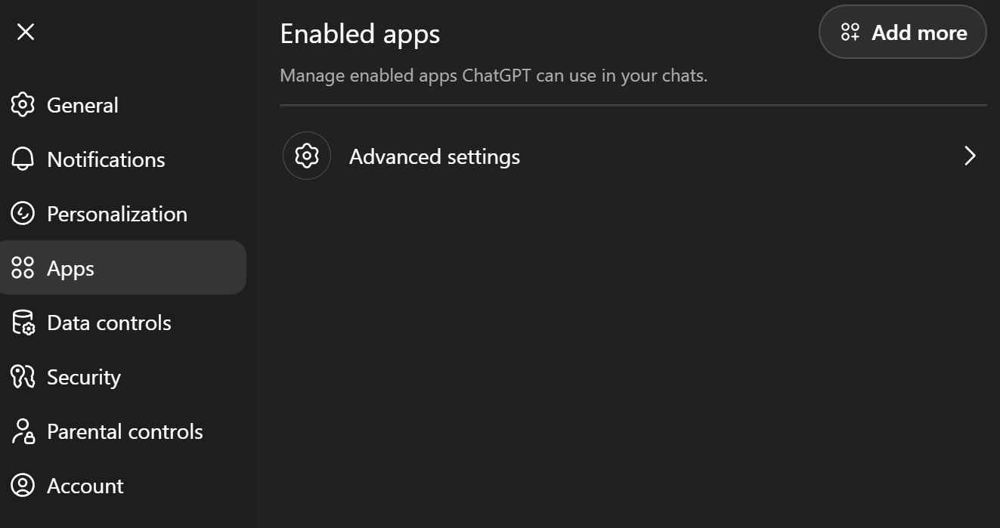
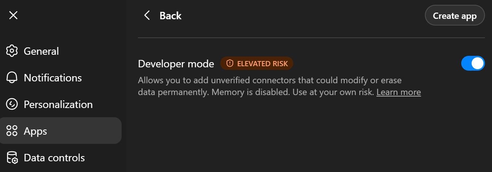
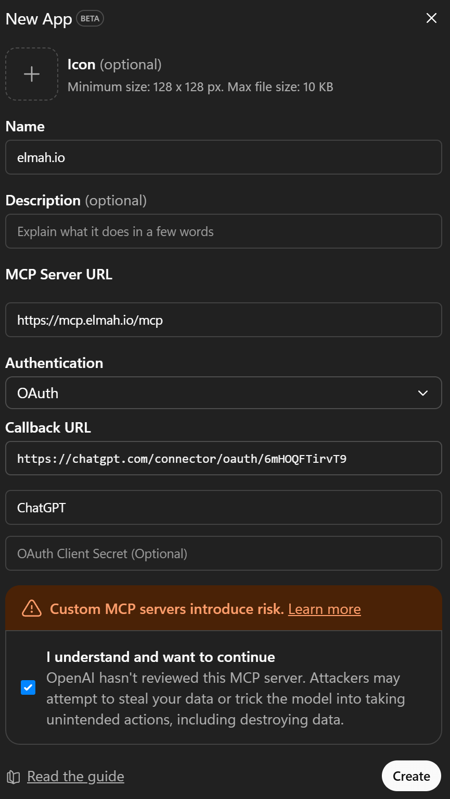

# Add MCP Server to ChatGPT

ChatGPT supports adding MCP servers in developer mode. Follow these steps to integrate elmah.io.

- Inside of ChatGPT, click your profile in the lower left corner and click on **Settings**.
- Click the **Apps** tab:

- Click **Advanced settings** and enable **Developer mode**:

- Click **Back** and **Create app**. Fill in the elmah.io MCP server details (ChatGPT will automatically fill in the callback URL):

- Click the **Create** button and ChatGPT will open a browser window, asking you to sign into elmah.io.
- When signed in, the elmah.io MCP server is added and ready to use.