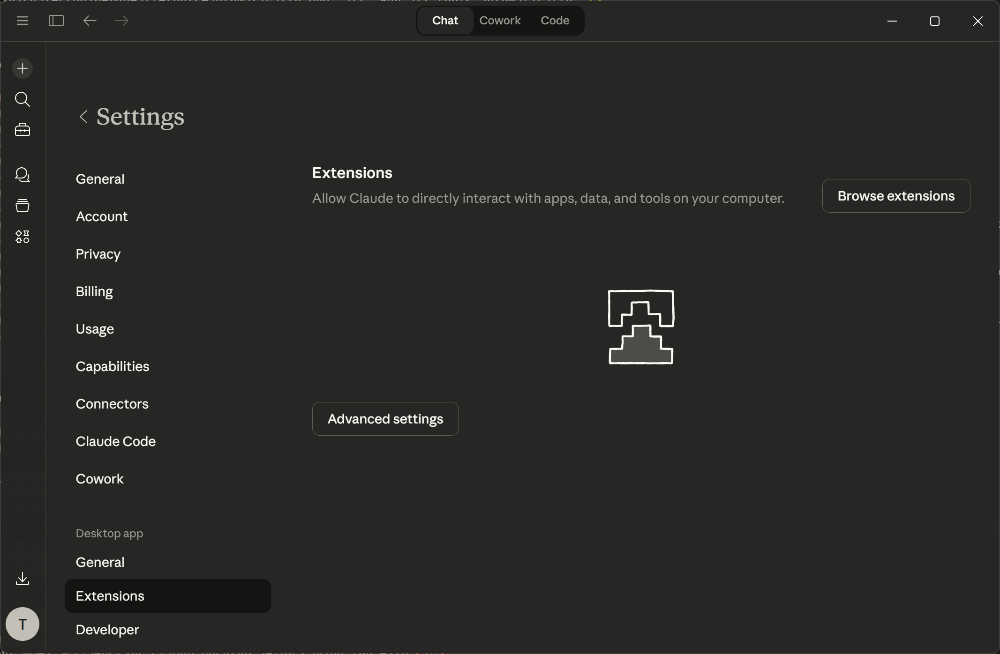
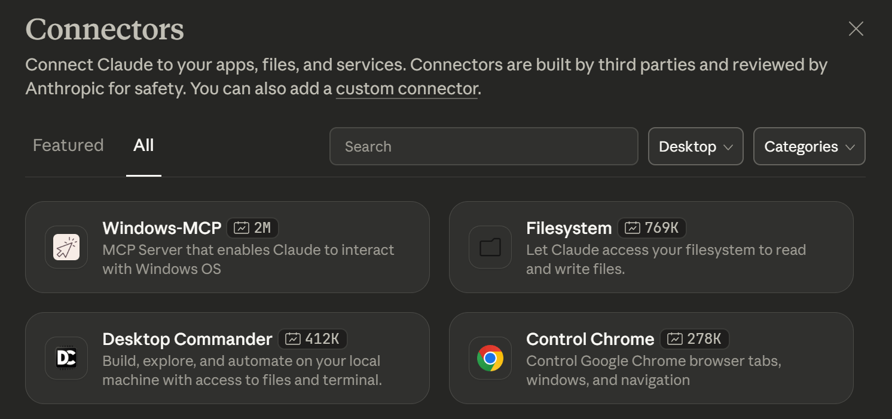
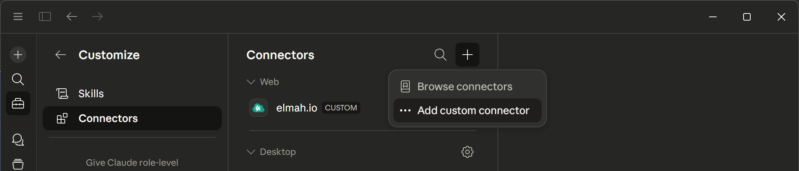
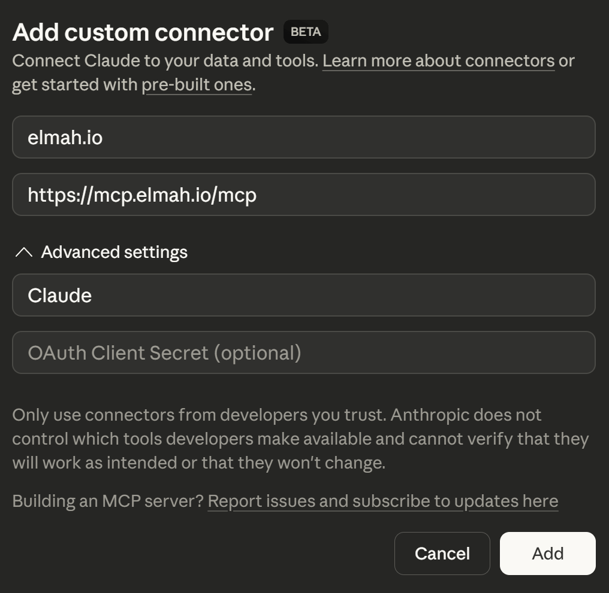
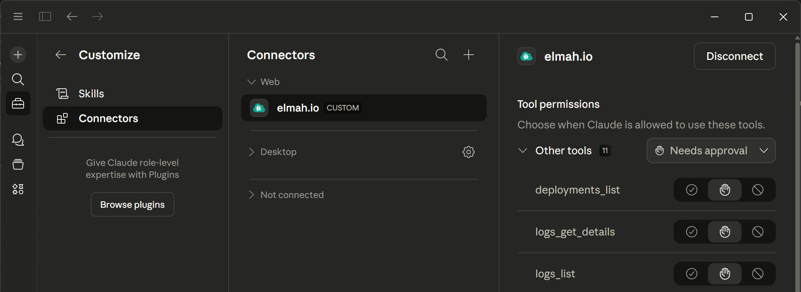
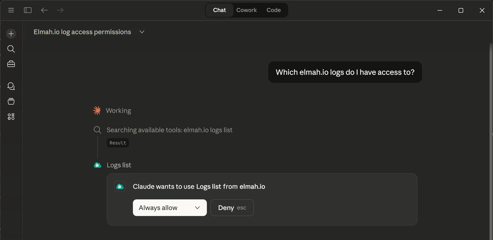

# Add MCP Server to Claude Desktop

To use elmah.io tools in Claude Desktop, you need a Claude subscription with **Custom Connectors** available.

- Open Claude Desktop and go to **File > Settings**.
- Beneath **Desktop app**, click the **Extensions** tab:

- Click the **Browse extensions** button, then click the **custom connector** link in the top:

- Click the **Plus** icon and select the **Add custom connector** option:

- In the **Add custom connector** dialog, input the values for the elmah.io MCP server as shown below:

- Click the **Add** button and a browser window will open, asking you to sign into elmah.io.
- When signed in, the elmah.io connector will be added to the list of **Web** connectors and the available tools will be listed when selecting the connector:

- The elmah.io MCP server is now ready for use. You will be asked permission every time Claude Desktop wants to call a tool. You can select **Always allow** on all or individual tools on the settings screen, or in the dropdown on the chat window to allow Claude Desktop to always call a tool when needed:

