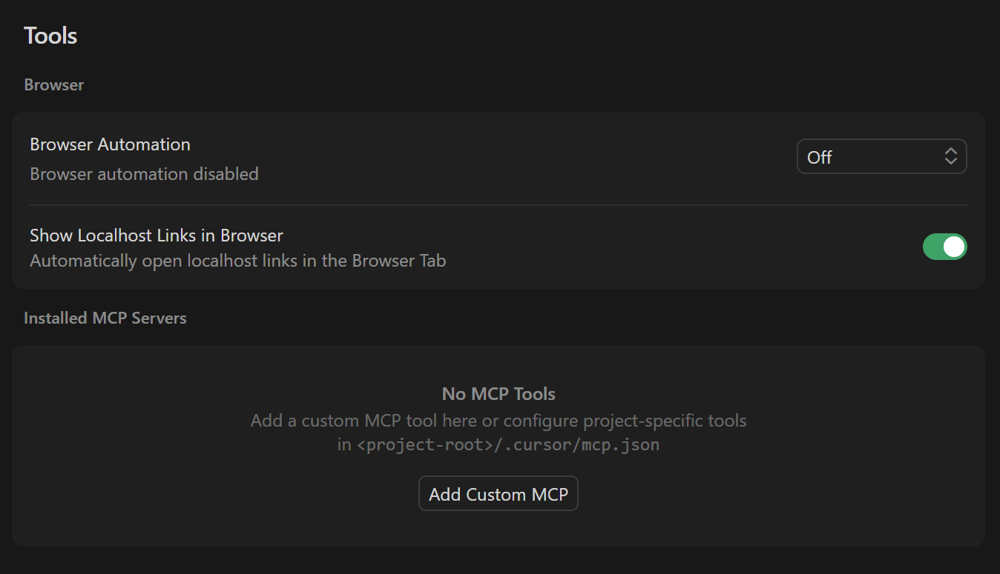
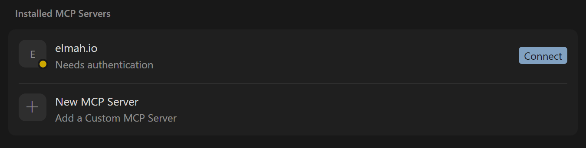

# Add MCP Server to Cursor AI

Cursor supports MCP natively. Follow these steps to integrate elmah.io.

- Inside of Cursor, click **File > Preferences > Cursor Settings** to open the **Cursor Settings** screen.
- In the left menu, click the **Tools & MCP** item.



- Click the **Add Custom MCP** item which will open a file editor on the `mcp.json` file.
- Add the following MCP configuration to include elmah.io's MCP server:

```json
{
  "mcpServers": {
    "elmah.io": {
      "url": "https://mcp.elmah.io/mcp",
      "auth": {
        "CLIENT_ID": "cursor"
      }
    }
  }
}
```

- Navigate back to **Cursor Settings** and observe the elmah.io MCP server is now added and need authentication:



- Click the **Connect** button and allow Cursor to open an external website. A browser window will open, asking you to sign into elmah.io.
- When signed in, the elmah.io MCP server will be added to the list of installed MCP servers and the available tools will be listed when expanding the server. The MCP server is now ready for use.