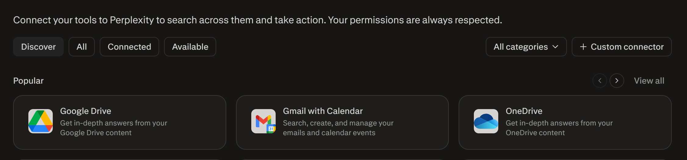
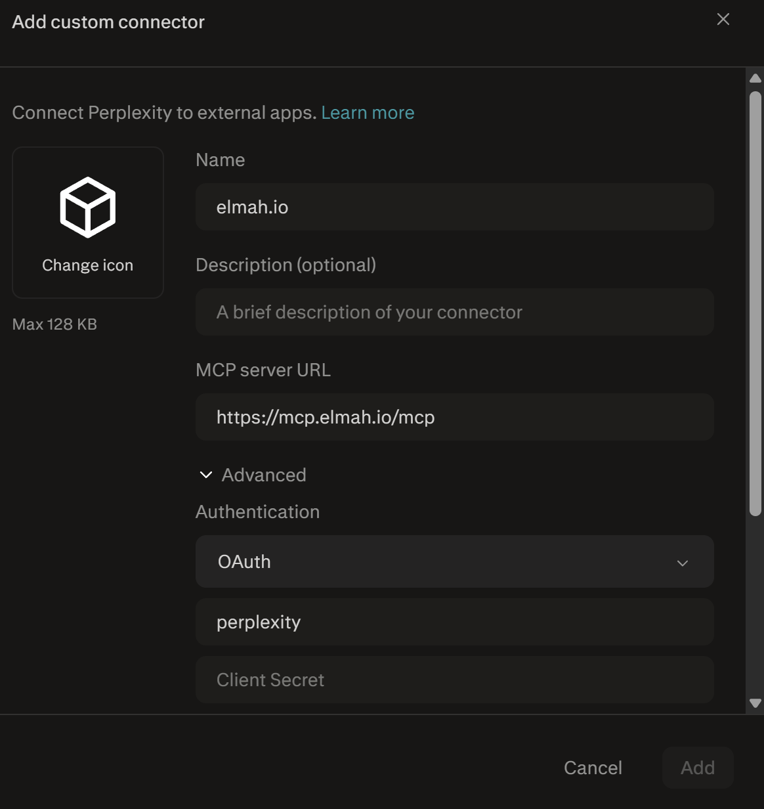
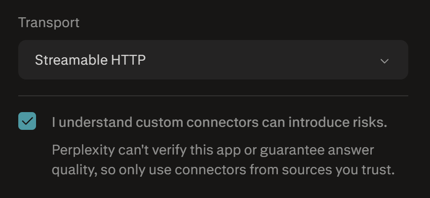
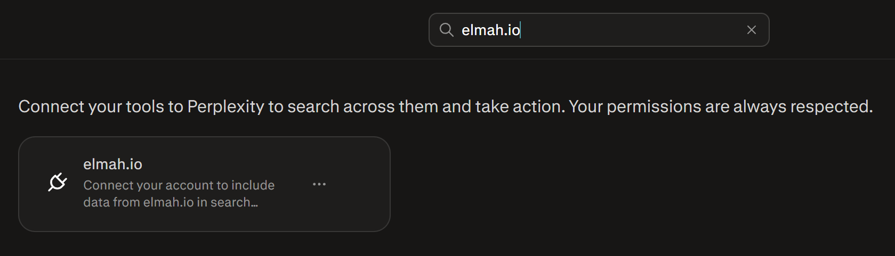
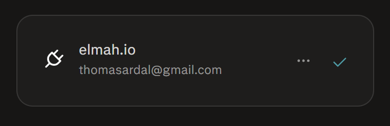
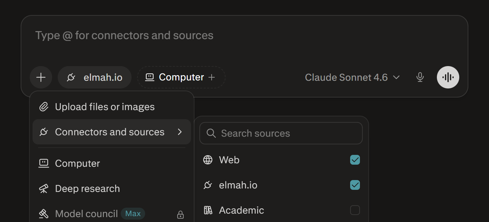

# Add MCP Server to Perplexity AI

Perplexity AI supports adding MCP servers through **Connectors**. You will need a paid subscription of Perplexity to add custom connectors.

- Inside Perplexity, click your profile in the lower left corner and click on **All settings**.
- In the left menu, click **Connectors**. This will show the list of available connectors:

- Click the **+ Custom connector** button and input the following values:

- Make sure to expand **Advanced**, select **OAuth**, and input a **Client ID** of your choice. Also select **Streamable HTTP** beneath **Transport** and enable the checkmark in **I understand custom connectors can introduce risks**:

- Click the **Add** button and search for the new connector:

- Click the connector in the search result. A browser window will open, asking you to sign in to elmah.io. When successfully signed in, Perplexity will show a checkmark next to the connector:

- On the prompt page, make sure to enable the elmah.io connector to allow Perplexity to call the MCP server:

