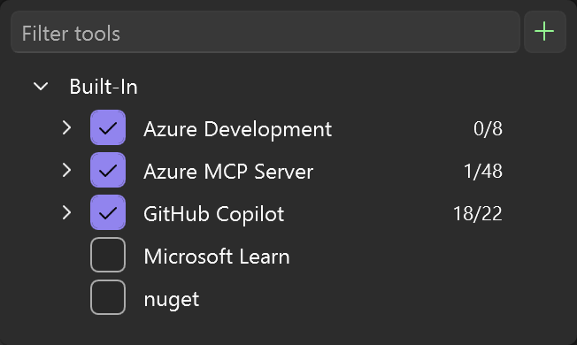
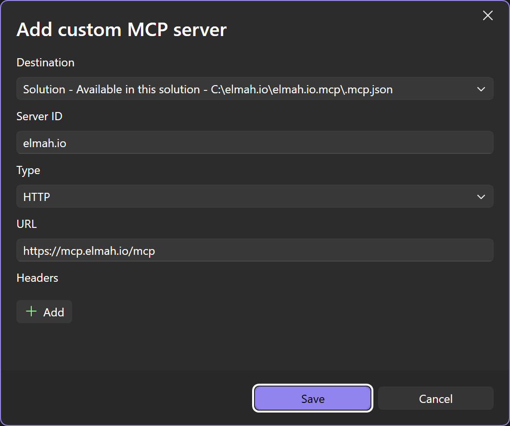
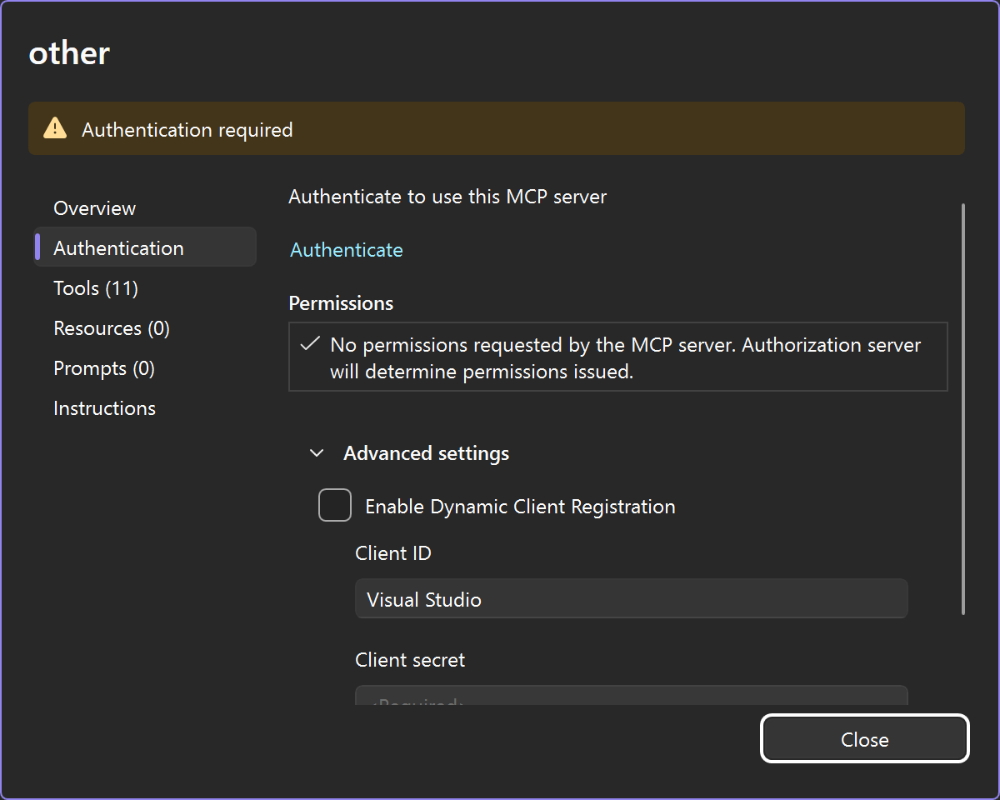
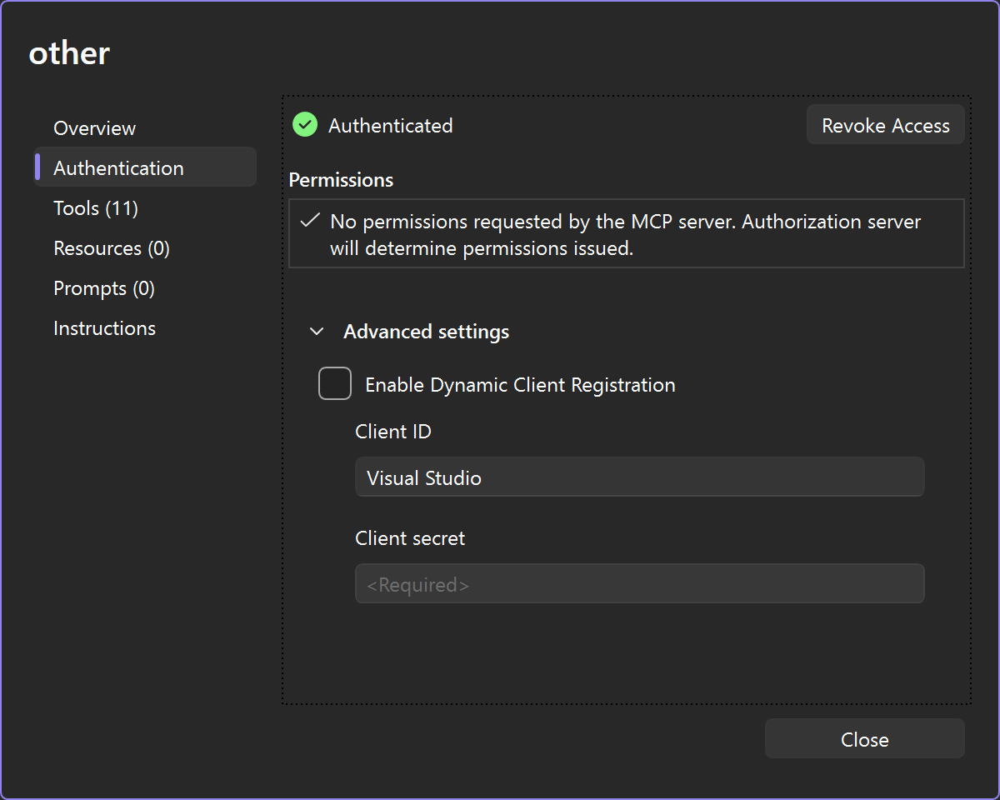
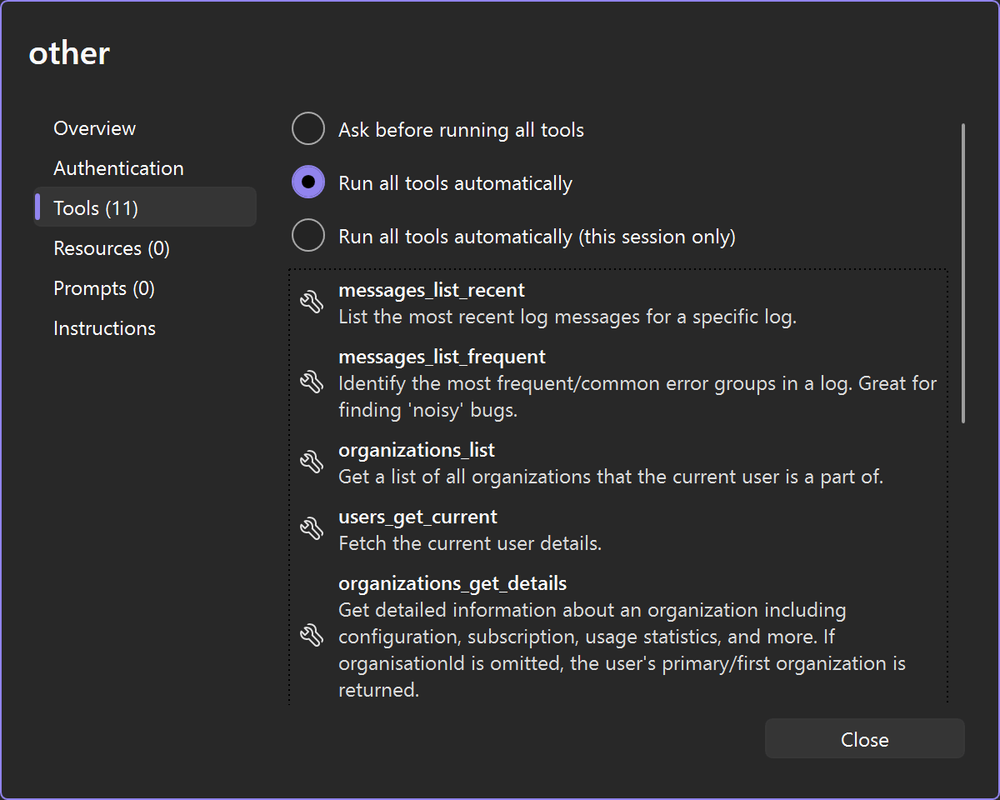

# Add MCP Server to Visual Studio

Visual Studio integrates MCP through GitHub Copilot Agent Mode.

- Open the **GitHub Copilot Chat** window.
- Select **Agent** instead of **Ask** in the dropdown in the lower left corner.
- Click the **Select tools** button (wrenches in the lower right corner):

- Click the green **Plus** button in the top right corner and input the values shown here:

- Once added, click the **Select tools** button again. The **elmah.io** MCP server will be disabled as a default. Enable the checkbox left of the name.
- Click the three dots button next to the MCP server and select **Configure**.
- In the configuration dialog, select the **Authentication** tab. Disable the check in **Enable Dynamic Client Registration** and give your client a name:

- Click the **Authenticate** link and a browser window will open, asking you to sign into elmah.io.
- When signed in, the authenticate dialog will show a green checkmark next to the **Authenticated** link and the number of discovered MCP tools will be shown on the left:

- The elmah.io MCP server is now ready for use. You will be asked permission every time Copilot wants to call a tool. You can allow all tools by selecting **Run all tools automatically** in the **Tools** tab:

