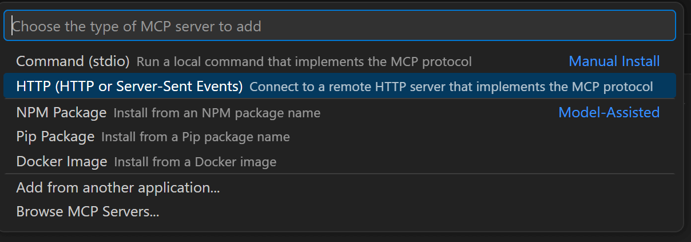
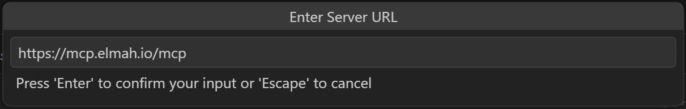
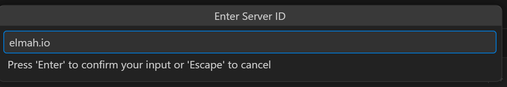
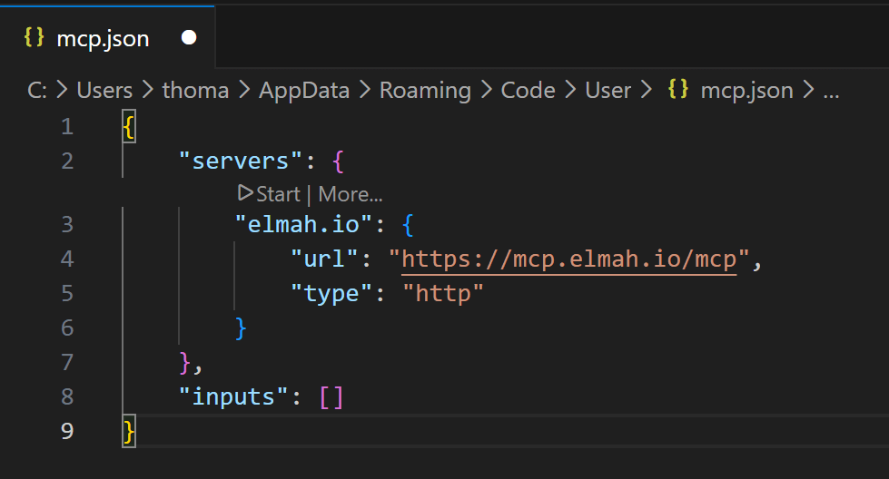
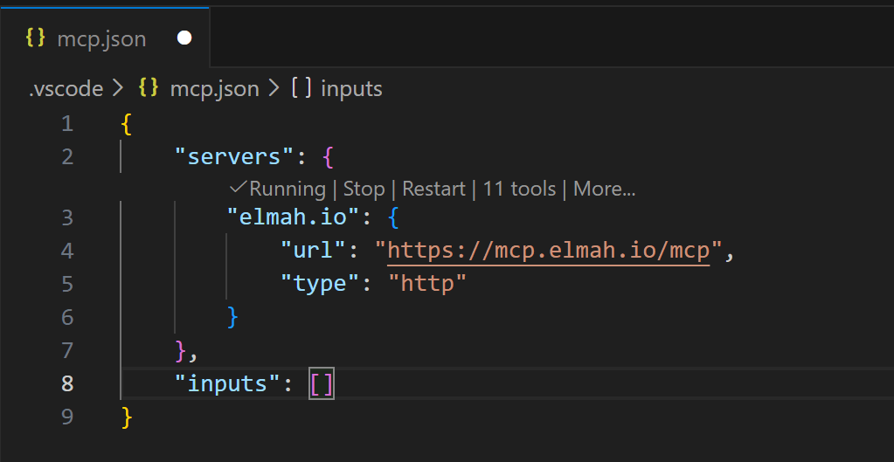
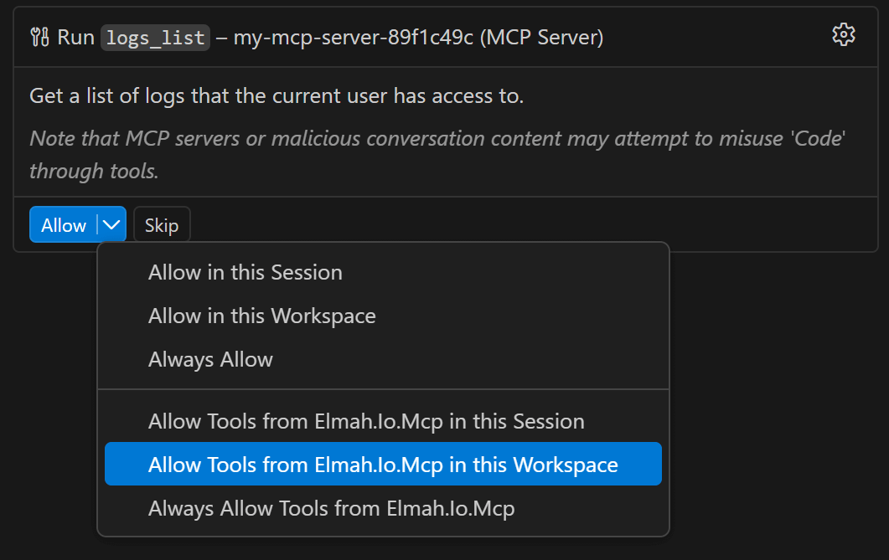

# Add MCP Server to VS Code

VS Code offer integrated MCP support. Learn how to set up elmah.io's MCP server in the following steps.

- Inside of VS Code, click **CTRL + Shift + p** to open the search view.
- Search for 'mcp:' and click **MCP: Add server...**.
- Select **HTTP** in the choose MCP server type dropdown:

- Input the elmah.io MCP server URL in the **Enter Server URL** field:

- Input a name for the MCP server:

- A new file named `mcp.json` is added to the code window. If VS Code doesn't automatically prompt you to authenticate, click the **Start** link above the MCP server name:

- VS Code will prompt to authenticate. Click the **Allow** button.
- VS Code will prompt to open an external website. Click the **Open** button and a browser will open, asking you to sign into elmah.io.
- When signed in, VS code will show the discovered MCP tools:

- The elmah.io MCP server is now ready for use. You will be asked permission every time VS Code wants to call a tool. You can allow all tools by selecting **Allow Tools from Elmah.Io.Mvc in this Workspace**:

