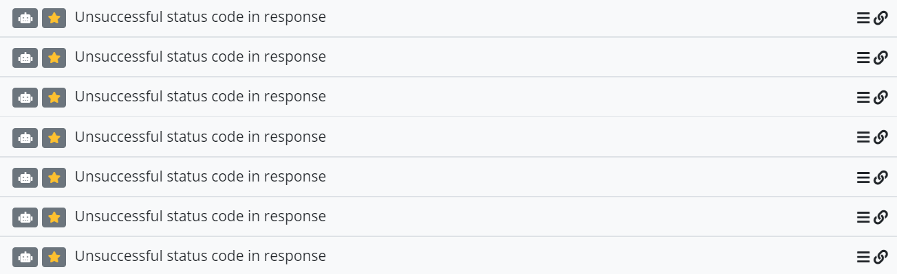
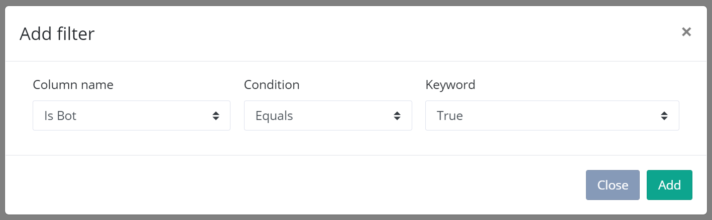
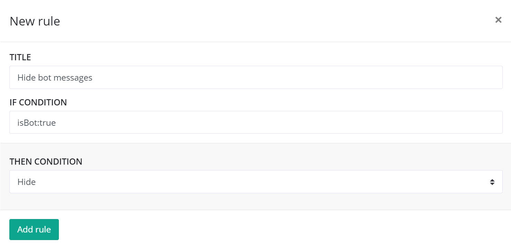

# Bot detection

elmah.io can help you with classifying log messages generated by bots and crawlers. When storing a log message, we run a range of checks to try and identify if a log message is generated by an automated script or a real human visitor of your website/application. In this case, a flag named `isBot` is set to `true` on the message. In case we couldn't identify a log message as generated by a bot, the flag is set to `false`.

Besides an automated check, you can also mark a log message as generated by a bot manually. This is done from within the elmah.io UI:


The benefit of marking log messages with the `isBot` flag manually is that elmah.io will then automatically mark new instances of this log message with `isBot=true` (this feature is available for automatically bot-marked log messages as well). By doing so you get the possibilities listed later in this article.

Log messages marked as generated by bots include a small robot icon on the search result:



## Search by or not by bots

If you want to show all log messages generated by bots you can create a search query like this:

```
isBot:true
```

Or include a search filter for the *Is Bot* field:



By reversing the filter, you see a list of log messages NOT generated by a bot, which can make it easier to get an overview of "real" errors.

## Hide or ignore log messages generated by bots

By using the `isBot` field in Hide and Ignore filters, you can let elmah.io automatically hide or ignore future log messages generated by bots. Be aware that creating ignore filters based on the `isBot` field is only available for users on the Enterprise plan.

To create a new filter, navigate to the *Rules* tab on log settings, and click the *Add a new rule* button. Input a query including the `isBot` field and select either the *Hide* or *Ignore* action:

