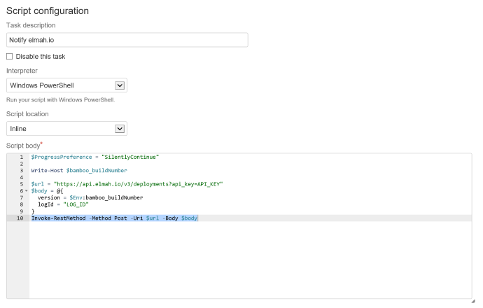

# Create deployments from Atlassian Bamboo

Setting up elmah.io Deployment Tracking on Bamboo is easy using a bit of PowerShell.

1. Add a new Script Task and select *Windows PowerShell* in *Interpreter*.

2. Select *Inline* in *Script location* and add the following PowerShell to *Script body*:

```powershell
$ProgressPreference = "SilentlyContinue"

Write-Host $bamboo_buildNumber

$url = "https://api.elmah.io/v3/deployments?api_key=API_KEY"
$body = @{
  version = $Env:bamboo_buildNumber
  logId = "LOG_ID"
}
[Net.ServicePointManager]::SecurityProtocol = [Net.SecurityProtocolType]::Tls12
Invoke-RestMethod -Method Post -Uri $url -Body $body
```



Replace `API_KEY` and `LOG_ID` and everything is configured. The script uses the build number of the current build as the version number (`$Env:bamboo_buildNumber`). If you prefer another scheme, Bamboo offers a range of <a href="https://confluence.atlassian.com/bamboo/bamboo-variables-289277087.html" target="_blank" rel="noopener noreferrer">variables</a>.