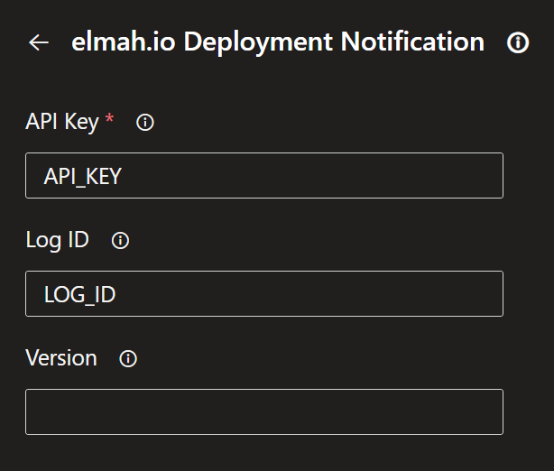
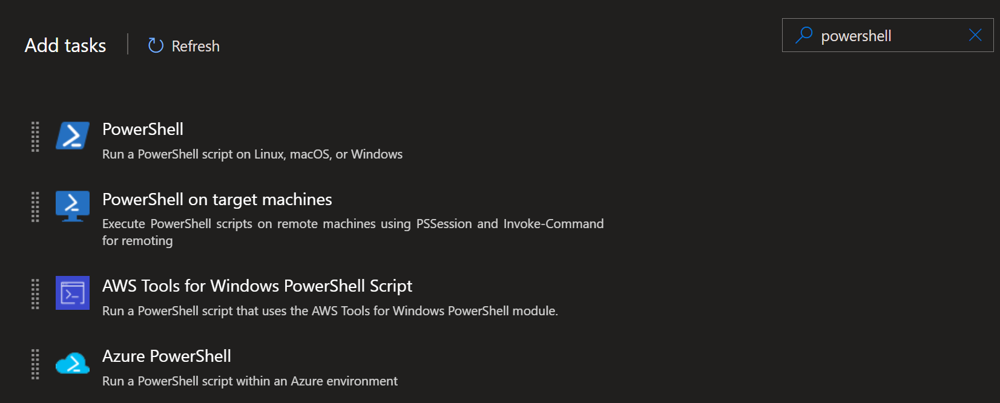
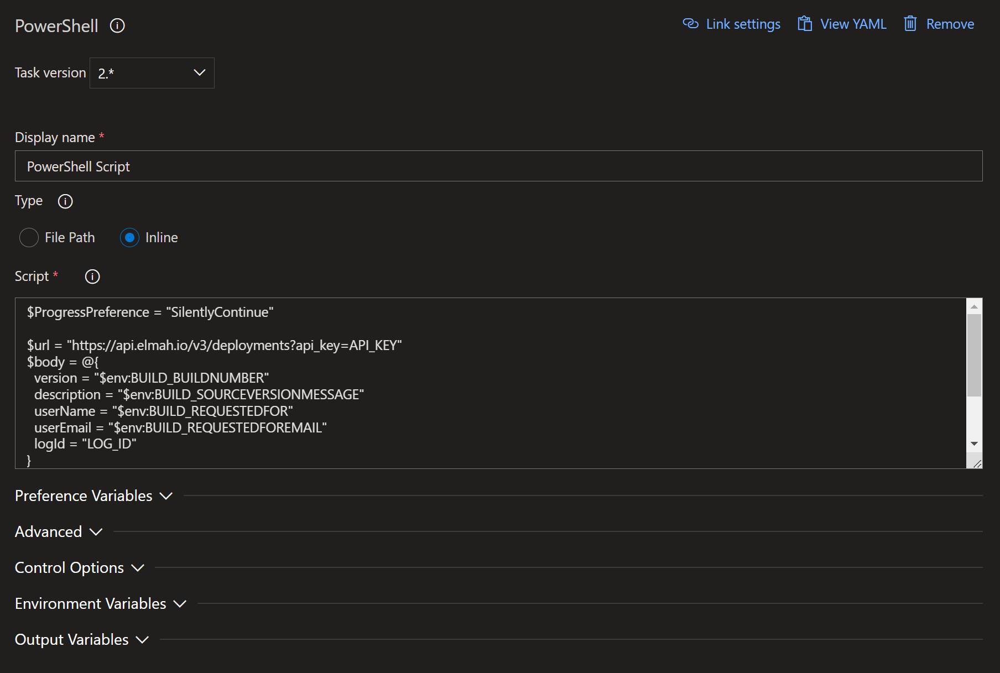

# Create deployments from Azure DevOps Pipelines

[TOC]
    
Notifying elmah.io about new deployments is possible as a build step in Azure DevOps Pipelines.

## Using YAML

1. Edit your build definition YAML file.

2. If not already shown, open the assistant by clicking the *Show assistant* button.

3. Search for 'elmah.io deploy'.

4. Click the *elmah.io Deployment Notification* task



5. Replace `API_KEY` with an API key ([Where is my API key?](where-is-my-api-key.md)) with permission ([How to configure API key permissions](how-to-configure-api-key-permissions.md)) to create deployments. If the deployment is specific to a single log, insert a log ID ([Where is my log ID?](where-is-my-log-id.md)) with the ID of the log instead of `LOG_ID`. Deployments without a log ID will show on all logs in the organization.

The task uses the current build number (`BUILD_BUILDNUMBER`) as the version name on elmah.io. If you want to override this behavior, you can insert a value in the *Version* text box.

6. Click the *Add* button and the new task will be added to your YAML definition. You typically want to move the deployment task to the last placement in *tasks*:

```yaml
steps:
# other steps
- task: ElmahIoDeploymentNotification@4
  inputs:
    apiKey: 'API_KEY'
    logId: 'LOG_ID'
```

## Using Classic editor

The deployment task extension is not available in the Classic editor. Here, you can use PowerShell instead.

1. Edit the build definition currently building your project(s).

2. Click the _Add task_ button and locate the _PowerShell_ task. Click _Add_.


3. Fill in the details as shown in the screenshot.


... and here's the code from the screenshot above:

```powershell
$ProgressPreference = "SilentlyContinue"

$url = "https://api.elmah.io/v3/deployments?api_key=API_KEY"
$body = @{
  version = "$env:BUILD_BUILDNUMBER"
  description = "$env:BUILD_SOURCEVERSIONMESSAGE"
  userName = "$env:BUILD_REQUESTEDFOR"
  userEmail = "$env:BUILD_REQUESTEDFOREMAIL"
  logId = "LOG_ID"
}
[Net.ServicePointManager]::SecurityProtocol = `
    [Net.SecurityProtocolType]::Tls12,
    [Net.SecurityProtocolType]::Tls11,
    [Net.SecurityProtocolType]::Tls
Invoke-RestMethod -Method Post -Uri $url -Body $body
```

Replace `API_KEY` with your API key ([Where is my API key?](where-is-my-api-key.md)) and `LOG_ID` ([Where is my log ID?](where-is-my-log-id.md)) with the id of the log representing the application deployed by this build configuration.