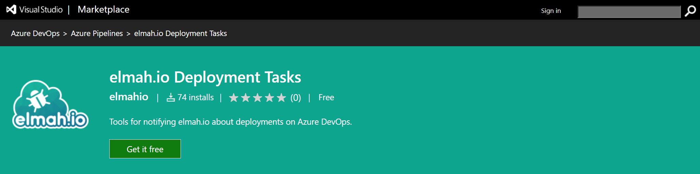
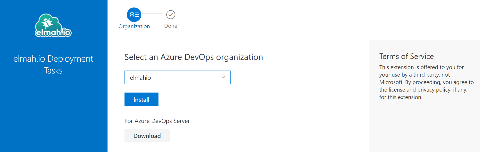
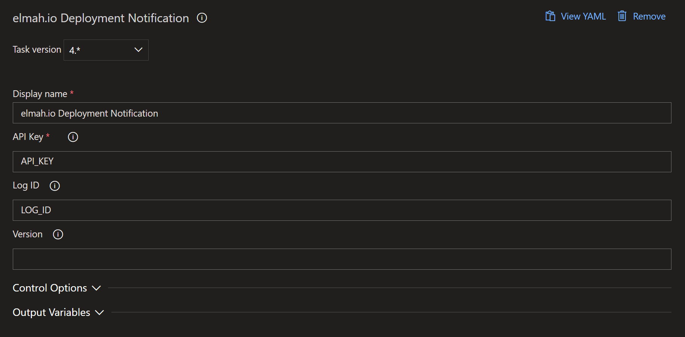

# Create deployments from Azure DevOps Releases

If you are using Releases in Azure DevOps, you should use our extension to notify elmah.io about new deployments. To install and configure the extension, follow the simple steps below:

1. Go to the [elmah.io Deployment Tasks](https://marketplace.visualstudio.com/items?itemName=elmahio.deploy-tasks) extension on the Azure DevOps Marketplace and click the _Get it free_ button:

2. Select your organization and click the *Install* button:

3. Go to your Azure DevOps project and add the *elmah.io Deployment Notification* task. Fill in all fields as shown here:

You will need to replace `API_KEY` with an API key ([Where is my API key?](where-is-my-api-key.md)) with permission ([How to configure API key permissions](how-to-configure-api-key-permissions.md)) to create deployments. If the deployment is specific to a single log, insert a log ID ([Where is my log ID?](where-is-my-log-id.md)) with the ID of the log instead of `LOG_ID`. Deployments without a log ID will show on all logs in the organization.

The task uses the current release name (`RELEASE_RELEASENAME`) as the version name on elmah.io. If you want to override this behavior, you can insert a value in the *Version* text box.

That's it! Azure DevOps will now notify elmah.io every time the release pipeline is executed.