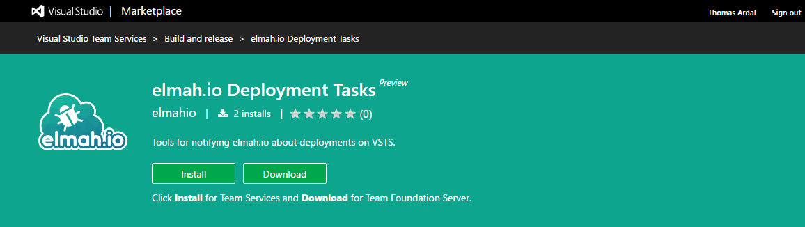
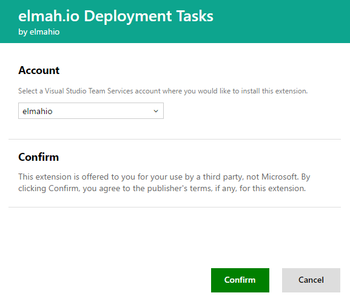
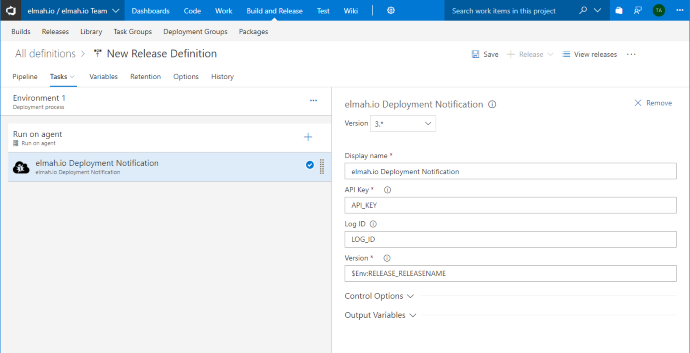

# Create deployments from Azure DevOps Releases

If you are using Releases in Azure DevOps, you should use our extension to notify elmah.io about new deployments. To install and configure the extension, follow the simple steps below:

1. Go to the [elmah.io Deployment Tasks extension](https://marketplace.visualstudio.com/items?itemName=elmahio.deploy-tasks) on the Visual Studio Marketplace and click _Install_ (log in if not already).

2. Select the account to install the extension into and click _Confirm_:

3. Go to your Azure DevOps project and edit your Release definition.

4. Click _Add tasks_ and locate the elmah.io Deployment Notification task. Click _Add_.

5. Copy an API key ([Where is my API key?](https://docs.elmah.io/where-is-my-api-key/)) with the *Deployments* | *Write* permission ([How to configure API key permissions](https://docs.elmah.io/how-to-configure-api-key-permissions/)) from your organization settings page and paste it into the _API Key_ field. In most cases, you want to input the ID of the log new deployments belong to. As default, we use the release name on Azure DevOps as the version number string on elmah.io. If you require a custom naming scheme, change the value in the _Version_ field. All [default and custom release variables](https://docs.microsoft.com/en-us/vsts/build-release/concepts/definitions/release/variables?view=vsts&tabs=batch) are available through PowerShell variables. Finally, click _Save_.

That's it! Azure DevOps will now notify elmah.io every time the release definition is executed. Remember to input a specific log ID as well, if you want to support [versioning different services](/setup-deployment-tracking/#decorate-your-messages-with-a-version-number).