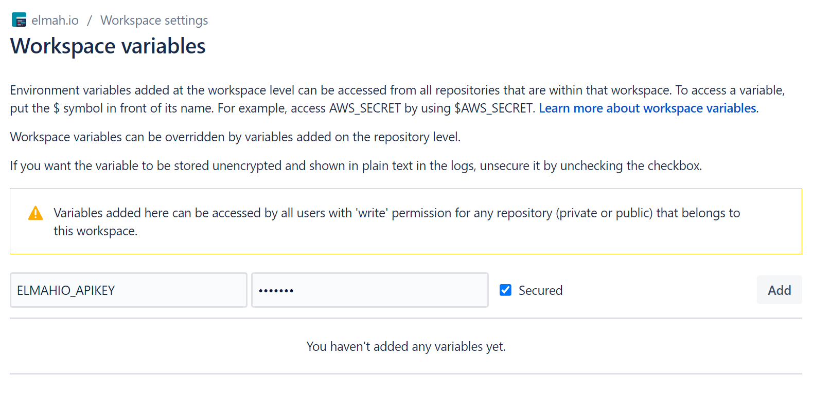

# Create deployments from Bitbucket Pipelines

Pipelines use scripts, embedded in YAML files, to configure the different steps required to build and deploy software. To notify elmah.io as part of a build/deployment, the first you will need to do is to add your API key as a secure environment variable. To do so, go to *Settings* | *Workspace Settings* | *Workspace variables* and add a new variable:



[Where is my API key?](where-is-my-api-key.md)

Then add a new script to your build YAML-file after building and deploying your software:

```yaml
pipelines:
  default:
    - step:
        script:
          # ...
          - curl -X POST -d "{\"version\":\"$BITBUCKET_BUILD_NUMBER\"}" -H "Content-Type:application/json" https://api.elmah.io/v3/deployments?api_key=$ELMAHIO_APIKEY
```

The script uses `curl` to invoke the elmah.io Deployments endpoint with the API key (`$ELMAHIO_APIKEY`) and a version number (`$BITBUCKET_BUILD_NUMBER`). The posted JSON can be extended to support additional properties like a changelog and the name of the person triggering the deployment. Check out the [API documentation](https://api.elmah.io/swagger/index.html) for details.