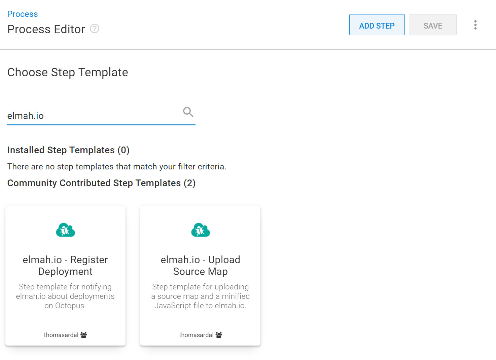

# Create deployments from Octopus Deploy

Notifying elmah.io of a new deployment from Octopus Deploy is supported through a custom step template. The step template can be installed in multiple ways as explained on <a href="https://octopus.com/docs/projects/community-step-templates" target="_blank" rel="noopener noreferrer">Community step templates</a>. In this document, the step template will be installed directly from the *Process Editor*:

1. Go to the *Process Editor* and click the **ADD STEP** button. In the *Choose Step Template* section search for 'elmah.io':

2. Hover over the 'elmah.io - Register Deployment' community template and click the **INSTALL AND ADD** button.

3. In the *Install and add* modal click the **SAVE** button.

4. The step template is now added to the process. Fill in your API key ([Where is my API key?](https://docs.elmah.io/where-is-my-api-key/)) and log ID ([Where is my log ID?](https://docs.elmah.io/where-is-my-log-id/)) in the step template fields and click the **SAVE** button:

And we're done. On every new deployment, Octopus Deploy will notify elmah.io. In case you want an alternative version naming scheme, the *Version* field in the step template can be used to change the format.