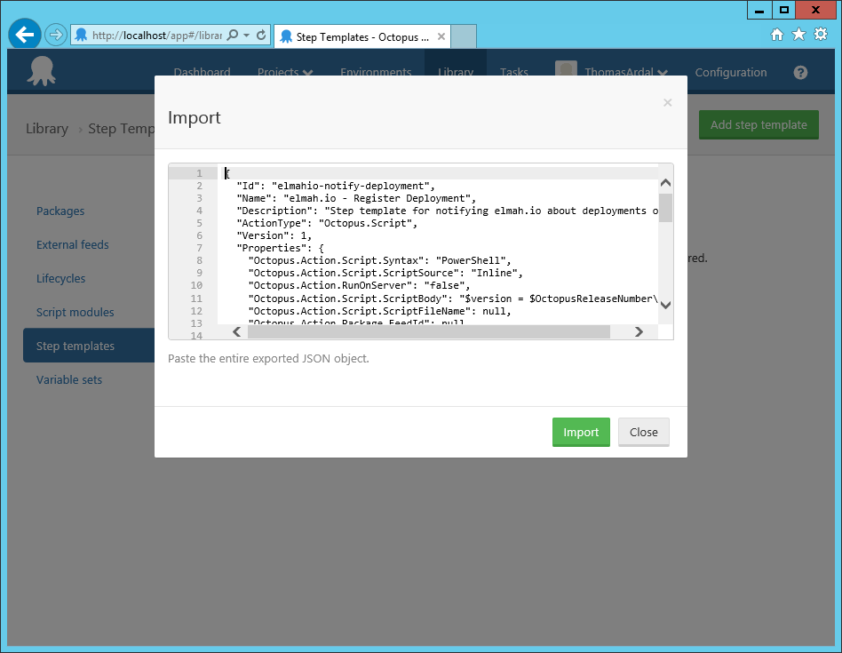
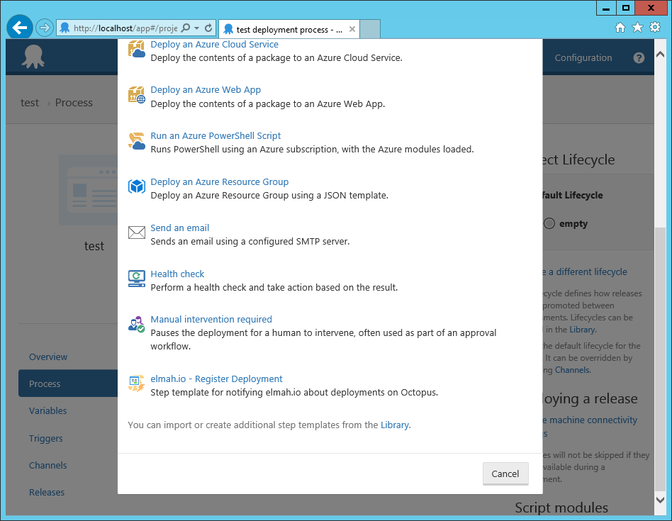

# Create deployments from Octopus Deploy

Notifying elmah.io of a new deployment from Octopus Deploy, is supported through a custom step template. To install and configure the template, follow the steps below:

1. Go to the  [elmah.io - Register Deployment](https://library.octopusdeploy.com/step-template/actiontemplate-elmah.io-register-deployment) step template on the Octopus Deploy Library.

2. Click the _Copy to clipboard_ button.

3. Click _Library_ in the header on your Octopus Deploy instance and go to the _Step templates_ tab.

4. Click the _Import_ link and paste the step template copied from the Library. Then click _Import_.

5. Go to the Process tab of your project on Octopus Deploy and click the _Add step_ button. The elmah.io step template is available in the bottom of the list.

6. When added to the process, select _Octopus Server_ in _Run on_ and input your API key found on your organization settings page. Optionally input a log ID, to [support multiple services](#versioning-different-services).

And we're done. On every new deployment, Octopus Deploy will notify elmah.io.