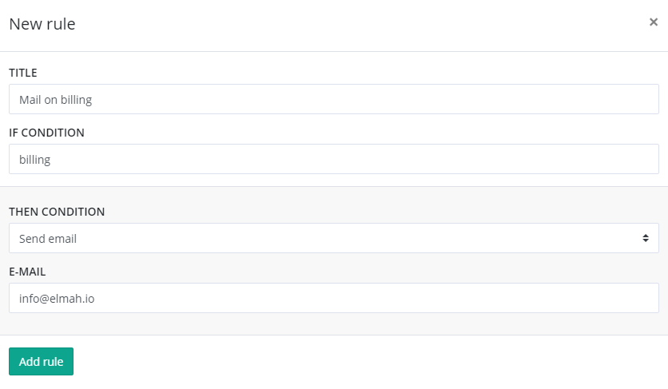

# Creating Rules to Perform Actions on Messages

elmah.io comes with a great rule engine for performing various actions when messages are logged in your log.

This guide is also available as a short video tutorial here:

  <iframe class="embed-responsive-item" src="https://www.youtube.com/embed/TLzQNX4MFkE?rel=0" allowfullscreen></iframe>

The rule engine is located beneath each log on the log settings page:

A rule consists of three parts: a title, a query and an action.

The title should be a short text explaining what this rule does. We don't use the title for anything, so please write something that helps you identify rules and to keep them apart.

The query should contain either a full-text search string or a Lucene query. When new messages are logged, the message is matched up against all queries registered on that log. If and only if a message matches a query, the action registered on the rule is performed.

As mentioned above, the action part of a rule is executed when a message matches the query specified in the same rule. An action can be one of four types: Ignore, Hide, Mail and HTTP Request. In order to illustrate how to use each action type, here are four examples on useful rules.

## Ignore errors with a HTTP status code of 400

To ignore all messages with a HTTP status code of 400, you would need to set-up the following:

| Title | Query | Then |
|---|---|---|
| Ignore 400s | `statusCode:400` | Ignore |

The rule would look like this in the UI:

## Hide warnings

To hide all messages with a severity of `Warning`, you would need to set up the following:

| Title | Query | Then |
|---|---|---|
| Hide Warnings | `severity:Warning` | Hide |

The rule would look like this in the UI:

## Send an email on all messages containing a word

To send an email on all messages containing the word _billing_ somewhere, you would need to set up the following:

| Title | Query | Then |
|---|---|---|
| Mail on billing | `billing` | Email |

The rule would look like this in the UI:

## Make a HTTP request on all new and fatal messages

To make a HTTP request on every new message with a severity of `Fatal`, you would need to set up the following:

| Title | Query | Then |
|---|---|---|
| Request on new fatal | `isNew:true AND severity:Fatal` | HTTP |

The rule would look like this in the UI:

