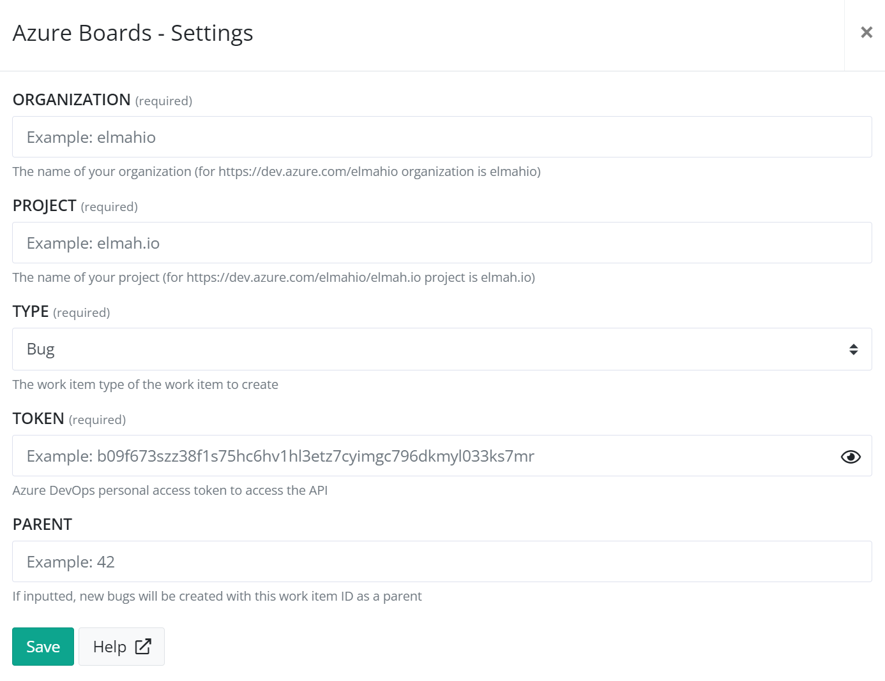

# Install Azure Boards App for elmah.io

## Get your personal access token

To create bugs on Azure Boards, you will need to generate a personal access token. Go to Azure DevOps and click the *User settings* icon in the top right corner. Select the *Personal access tokens* menu item in the dropdown. Finally, click the *New Token* button and fill in the details as shown below:

For this example, we have picked a 90-day expiration period, but you can decide on a shorter or longer period if you'd like. Remember to enable the *Read & write* scope under **Work Items**. Next, click the *Create* button and copy the generated token.

> Bugs created by elmah.io will have the *CreatedBy* set to the user generating the personal access token. If you want to identify bugs created by elmah.io, you should create the token from a new user (like elmahio@yourdomain.com).

## Install the Azure Boards App on elmah.io

Log into elmah.io and go to the log settings. Click the Apps tab. Locate the Azure Boards app and click the *Install* button:

Paste the token copied in the previous step into the *Token* textbox. In the *Organization* textbox, input the name of your organization. For https://dev.azure.com/myorg/myproject, the organization name would be *myorg*. In the *Project* textbox, input the name of the project containing your board. For https://dev.azure.com/myorg/myproject, the project name would be *myproject*.

The *Type* dropdown will allow you to select another work item template than *Bug*. This will decide how the created issues from elmah.io are shown inside the Azure Boards UI. *Bug* and *Task* are available in most processes. *User Story* is part of the *Agile* process while *Product Backlog Item* is part of the *Scrum* process. So, pick according to the process you have configured on the selected project.

If you want to embed all bugs created by the app beneath an overall work item, epic, or similar, fill in the optional ID in the *Parent* field.

Click *Save* and the app is added to your log. When new errors are logged, bugs are automatically created in the configured Azure Board.