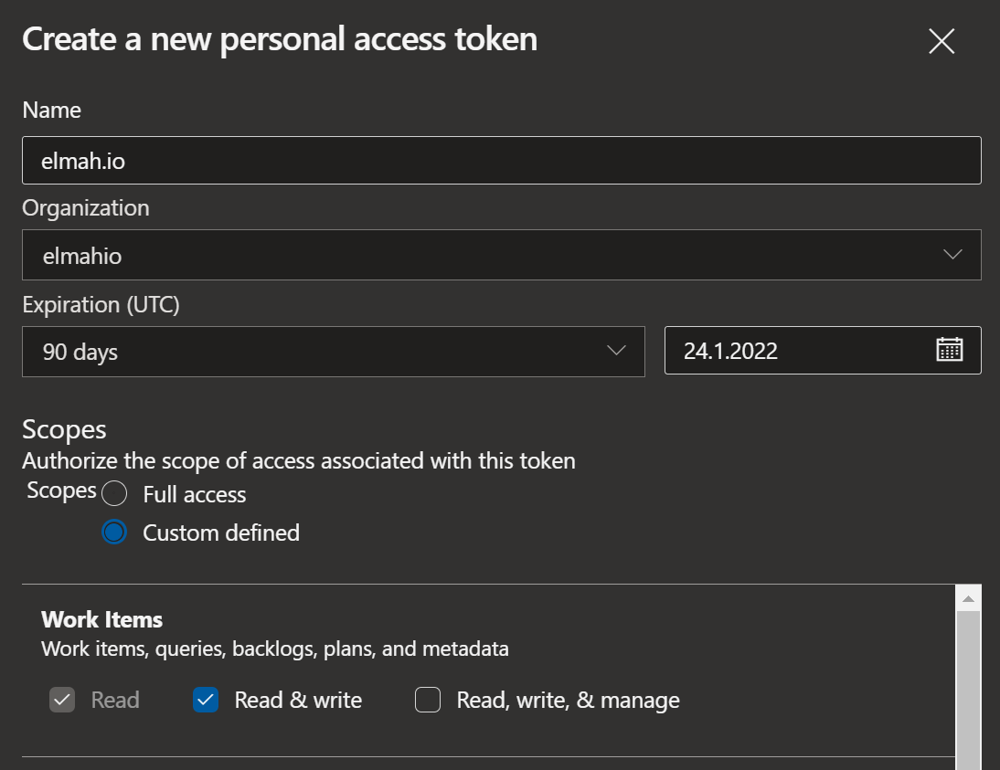

# Install Azure Boards App for elmah.io

## Get your personal access token

In order to create bugs on Azure Boards, you will need to generate a personal access token. Go to Azure DevOps and click your user in the top right corner. Click *Security* in the dropdown and select the *Personal access token* item in the left menu. Finally, click the *New token* button and fill in the details as shown below:

{: .image-600 }

For this example, I have picket the longest possible expiration period, but you can decide for a shorter period if you'd like. Remember to enable the *Read & write* scope. Next, click the *Create* button and copy the generated token.

> Bugs created by elmah.io will have the *CreatedBy* set to the user generating the personal access token. If you want to identify bugs created by elmah.io, you should create the token from a new user (like elmahio@yourdomain.com).

## Install the Azure Boards App on elmah.io

Log into elmah.io and go to the log settings. Click the Apps tab. Locate the Azure Boards app and click the *Install* button:

Paste the token copied in the previous step into the *Token* textbox. In the *Organization* textbox, input the name of your organization. For https://dev.azure.com/myorg/myproject, the organization name would be *myorg*. In the *Project* textbox, input the name of the project containing your board. For https://dev.azure.com/myorg/myproject, the project name would be *myproject*.

Click *Save* and the app is added to your log. When new errors are logged, bugs are automatically created in the configured Azure Board.