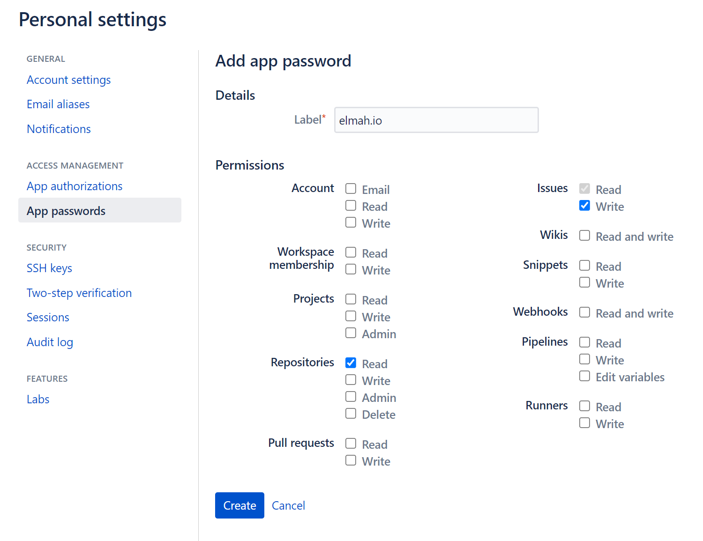
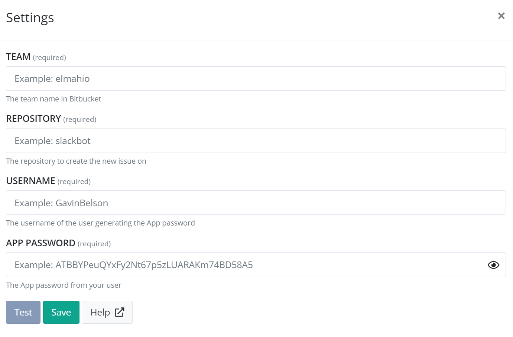

# Install Bitbucket App for elmah.io

## Get your App password

To allow elmah.io to create issues on Bitbucket, you will need an App password. App passwords can be generated by clicking your user in the top right corner and selecting *Personal settings*. In the left menu, click the *App passwords* page (`https://bitbucket.org/account/settings/app-passwords/`). To create a new password, click the *Create app password* button and input the following information:

elmah.io only need the *Issues - Write* permission to create issues. To test the inputted values on elmah.io (later step) also check the *Repositories - Read* permission.

After clicking the *Create* button, copy the generated app password.

## Install the Bitbucket App on elmah.io

Log into elmah.io and go to the log settings. Click the Apps tab. Locate the Bitbucket app and click the *Install* button:

Paste the App password copied in the previous step into the *APP PASSWORD* textbox. In the _TEAM_ textbox, input the name of the team/workspace owning the repository you want to create issues in. In the _REPOSITORY_ textbox input the name of the repository. In the _USERNAME_ textbox, input the name of the user generating the App password. In older installations, this can also contain the team/workspace name.

Click *Save* and the app is added to your log. When new errors are logged, issues are automatically created in the configured Bitbucket repository.