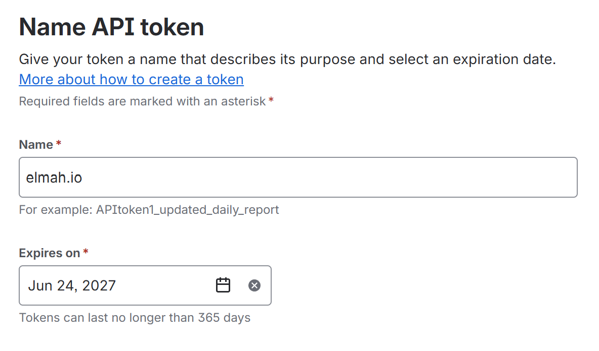
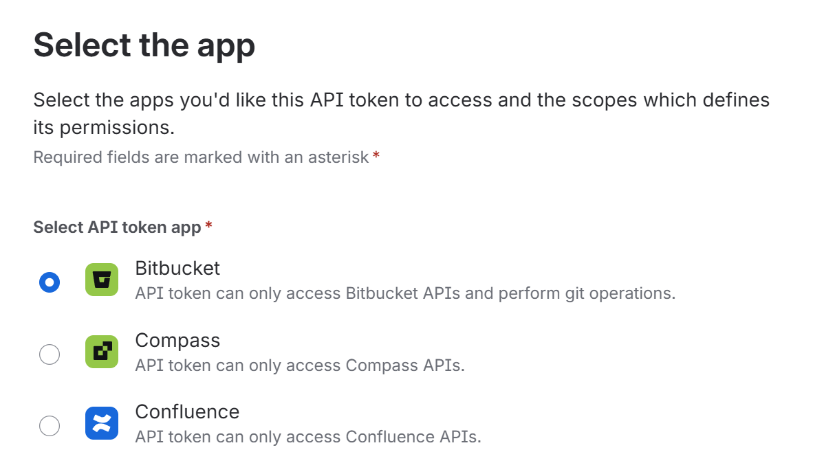
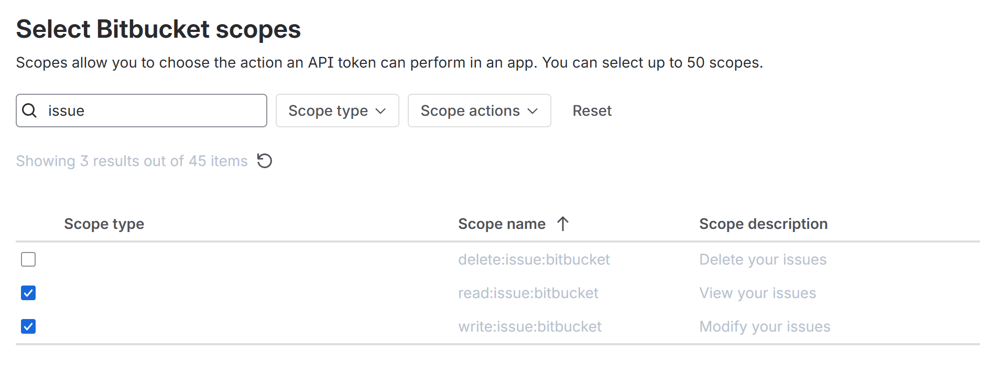
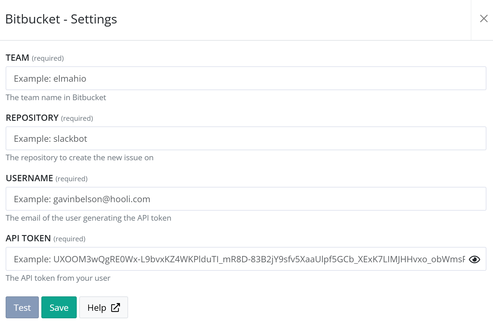

# Install Bitbucket App for elmah.io

## Get your API token

To allow elmah.io to create issues on Bitbucket, you will need an API token. API tokens can be generated by clicking your user in the top right corner and selecting *Account settings*. In the top menu, click the *Security* page, and click the *Create and manage API tokens* link (`https://id.atlassian.com/manage-profile/security/api-tokens`). To create a new API token, click the *Create API token with scopes* button.

In the first step, input a name of choice, select an expiration date for the token, and click *Next*:

In the second step, select *Bitbucket* and click *Next*:

On the scopes page, make sure to select the following scopes: `read:issue:bitbucket`, `write:issue:bitbucket`, and `read:repository:bitbucket` (can be left out but the *Test* button on elmah.io won't work then):

On the confirmation page, click the *Create token* button and copy the generated API token.

## Install the Bitbucket App on elmah.io

Log into elmah.io and go to the log settings. Click the Apps tab. Locate the Bitbucket app and click the *Install* button:

Paste the API token copied in the previous step into the *API TOKEN* textbox. In the _TEAM_ textbox, input the name of the team/workspace owning the repository you want to create issues in. In the _REPOSITORY_ textbox input the name of the repository. In the _USERNAME_ textbox, input the email of the user generating the API token.

Click *Save* and the app is added to your log. When new errors are logged, issues are automatically created in the configured Bitbucket repository.