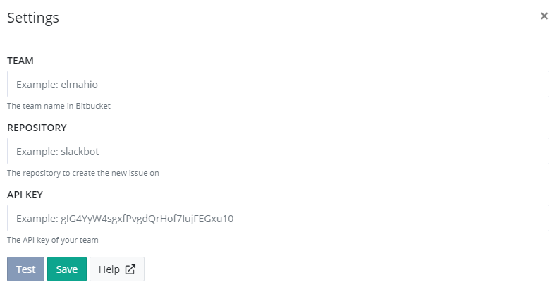

# Install Bitbucket App for elmah.io

## Get your API key

In order to allow elmah.io to create issues on Bitbucket, you will need your team's API key. API keys on Bitbucket are only supported om team accounts. Go to your team's settings page (like https://bitbucket.org/account/user/elmahio/groups/) and click _API key_ in the menu:

Copy the generated API key.

## Install the Bitbucket App on elmah.io

Log into elmah.io and go to the log settings. Click the Apps tab. Locate the Bitbucket app and click the *Install* button:

Paste the API key copied in the previous step into the _API Key_ textbox. In the _Team_ textbox, input the name of the team owning the repository you want to create issues in. In the *Repository* textbox input the name of the repository.

Click *Save* and the app is added to your log. When new errors are logged, issues are automatically created in the configured Bitbucket repository.