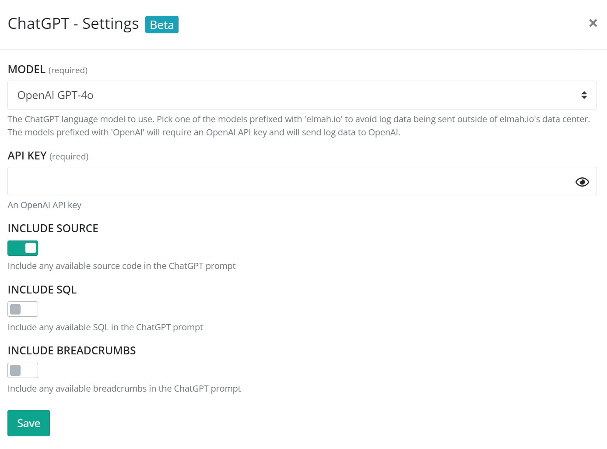
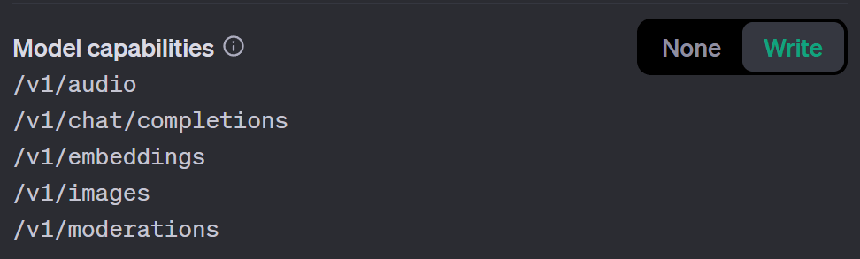

# Install ChatGPT for elmah.io

Log into elmah.io and go to the log settings. Click the Apps tab. Locate the ChatGPT app and click the *Install* button:

The app supports two hosting models for ChatGPT. You can either bring your own OpenAI API key or use a model hosted by us (available on the Enterprise plan). Both options currently support GPT-3.5-Turbo, GPT-4, GPT-4o, and GPT-4o mini.

To use OpenAI, select one of the models prefixed with 'OpenAI' and input your API key (<a href="https://help.openai.com/en/articles/4936850-where-do-i-find-my-openai-api-key" target="_blank">Where do I find my OpenAI API Key?</a>). If you prefer a restricted API key, make sure to enable the *Model capabilities* resource:

To use a model hosted by us, select one of the models prefixed with 'elmah.io'. When picking this option, your data will never leave our data center since the model is hosted directly on Azure.

As a default, elmah.io will only share the stack trace and a few other properties of an error with ChatGPT when you click the *Get suggestion* button in the elmah.io UI. If you want to include the source code, attached SQL, and/or breadcrumbs, you can enable one or more toggles. Sharing the source will require you to bundle your source code alongside errors as documented here: [How to include source code in log messages](how-to-include-source-code-in-log-messages.md).

Click *Save* and the app is added to your log. When you open errors valid for ChatGPT help, you will see a tab named *AI* next to *Detail*, *Inspector*, etc.