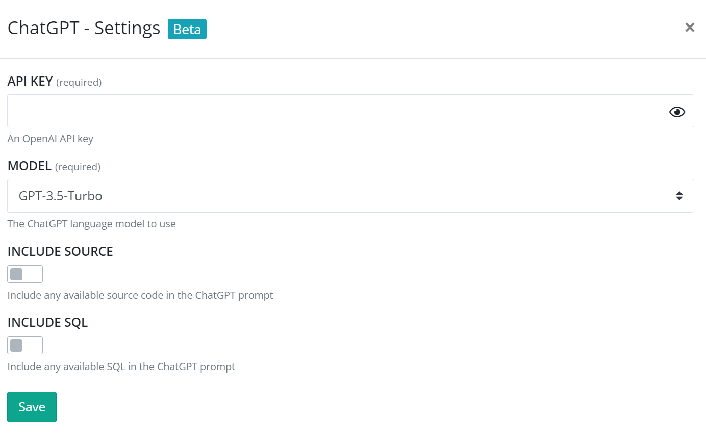

# Install ChatGPT for elmah.io

Log into elmah.io and go to the log settings. Click the Apps tab. Locate the ChatGPT app and click the *Install* button:

Input your OpenAI API key (<a href="https://help.openai.com/en/articles/4936850-where-do-i-find-my-openai-api-key" target="_blank">Where do I find my OpenAI API Key?</a>). Next, select which language model to use. We currently support GPT-3.5-Turbo and GPT-4.

As a default, elmah.io will only share the stack trace of an error with ChatGPT when you click the *Get suggestion* button in the elmah.io UI. If you want to include the source code and/or any SQL attached to the error, you can enable one or both toggles. Sharing the source will require you to bundle your source code alongside errors as documented here: [How to include source code in log messages](how-to-include-source-code-in-log-messages.md).

Click *Save* and the app is added to your log. When you open errors valid for ChatGPT help, you will see a tab named *AI* next to *Detail*, *Inspector*, etc.