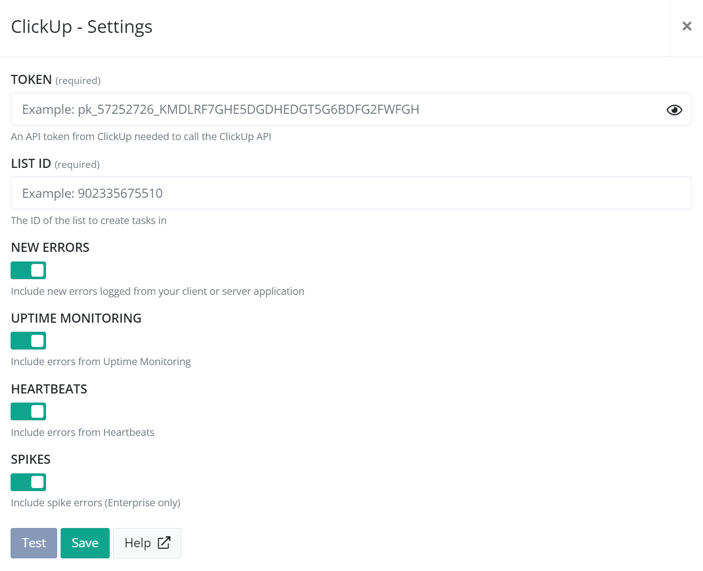
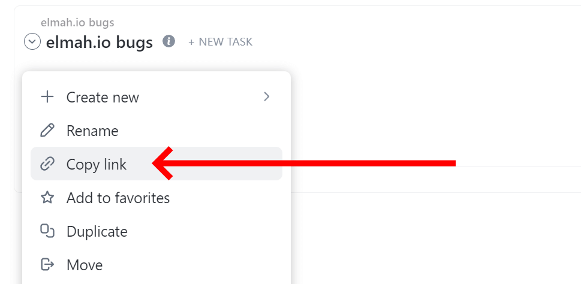

# Install ClickUp for elmah.io

Log in to elmah.io and go to the log settings page. Click the Apps tab. Locate the ClickUp app and click the *Install* button:



You will need to input a ClickUp API token and the ID of the list to create tasks. The API token can be generated by navigating to ClickUp, clicking the profile photo in the bottom left corner, and clicking *Apps*. It is important to click the *Apps* link beneath your profile and not the *ClickApps* link beneath the team. On the *Apps* page, you can generate and copy a new token beneath the *API Token* section.

The list ID can be found by going to the list on the ClickUp app and clicking the list name:



When copying the link, you will get a link similar to this:

```shell
https://app.clickup.com/.../v/li/901200300647
```

The list ID is the last part of the URL (`901200300647` in the example above).

When both the API token and list ID are inputted on elmah.io, click the *Test* button to test the values. When the *Test* button turns green, click the *Save* button, and the app is added to your log. When new errors are logged, tasks are automatically created in the configured ClickUp list.

## ClickUp Troubleshooting

If errors aren't showing up in ClickUp, please check that the following are all true:

- When clicking the *Test* button on the ClickUp app settings screen, the button turns green.
- There's a message logged in the log where you set up the ClickUp integration.
- The message is marked as new (yellow star next to the title on the search result).
- The message is either of severity `Error` or `Fatal`.

To trigger an error manually, go to [https://api.elmah.io/swagger/index.html](https://api.elmah.io/swagger/index.html) and input an elmah.io API key with the *Messages* - *Write* permission enabled. Expand *Messages* and the *POST* node with the URL `/v3/messages/{logId}`. Input your log ID and the following JSON:

```json
{
  "title": "This is a test",
  "severity": "Error"
}
```

Finally, click the *Try it out!* button and verify that the API returns a status code of *201*. The new error should show up in ClickUp. If testing this multiple times, you will need to make small adjustments to the title field inside the JSON for additional errors to be marked as new.