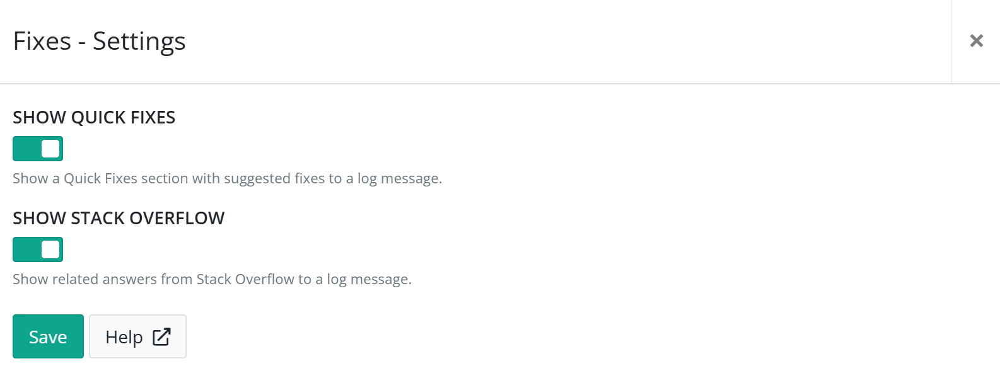

# Install Fixes for elmah.io

The **Fixes** app will show quick fixes and/or Stack Overflow answers related to the current log message on the extended details view. This app is installed on all logs as a default, but can be disabled if you want to disable one or both sections.

Log in to elmah.io and go to the log settings page. Click the Apps tab. Locate the Fixes app and click the *Install* button:

The app contains two toggles through which you can enable/disable both the Quick Fixes and the Stack Overflow view. Disabling one or both of the toggles will hide the corresponding section from the UI.

Click *Save* and the app is added to your log. Only enabled sections will be shown when you open the extended details view. No requests are made to Stack Overflow if the *SHOW STACK OVERFLOW* toggle is disabled.