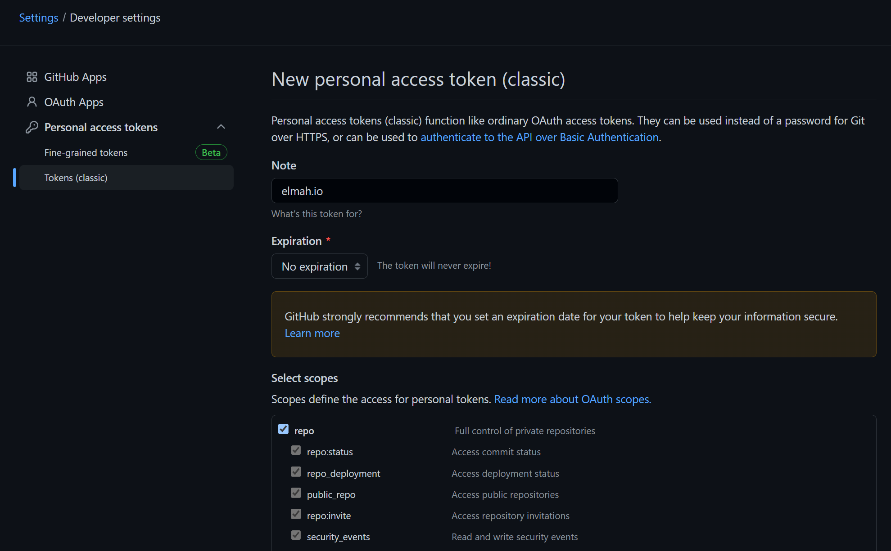
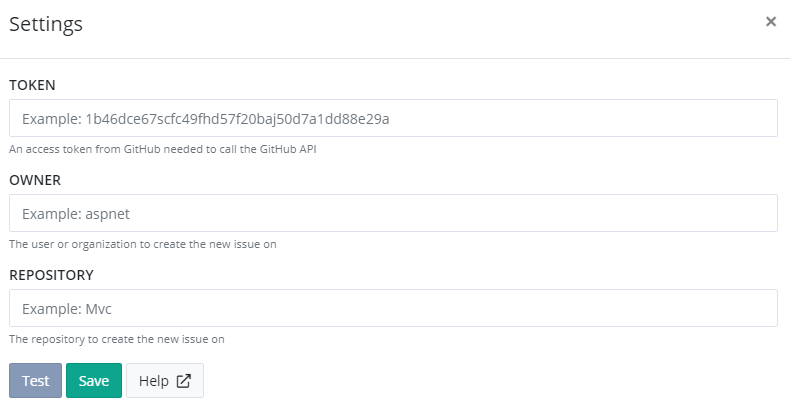

# Install GitHub App for elmah.io

## Generate Personal Access Token

To allow elmah.io to create issues on GitHub, you need a Personal Access Token. Sign in to GitHub, click your profile photo in the top right corner, and click *Settings*. On the Settings page click *Developer settings* followed by *Personal access token*. Here you can create a new token by clicking the *Generate new token (classic)* button:

Input a token note and select an expiration date. If the repository you want issues created in is public, make sure to check the _public_repo_ checkbox. If the repository is private, check the _repo_ checkbox. Finally, click the *Generate token* button, and copy the generated token (colored with a green background)

GitHub also supports fine-grained personal access tokens. This token can also be used on elmah.io. Make sure to select _Read and write_ in the _Issues_ permission.

## Install the GitHub App on elmah.io

Log into elmah.io and go to the log settings. Click the Apps tab. Locate the GitHub app and click the *Install* button:

Paste the token copied in the previous step into the *Token* textbox. In the *Owner* textbox, input the name of the user or organization owning the repository you want to create issues in. In the *Repository* textbox input the name of the repository.

Click *Save* and the app is added to your log. When new errors are logged, issues are automatically created in the configured GitHub repository.