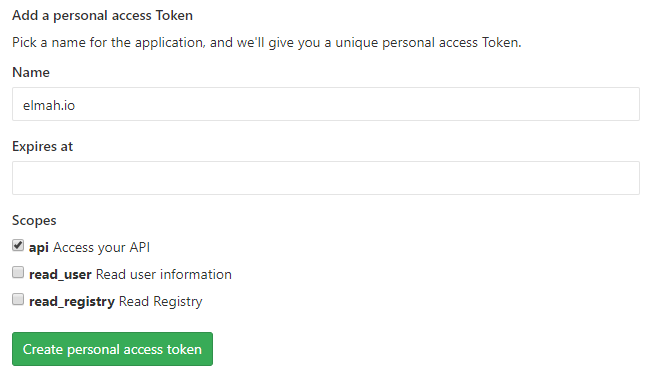

# Install GitLab App for elmah.io

## Generate Personal Access Token

In order to allow elmah.io to create issues on GitLab, you will need to generate a Personal Access Token. To do so, log into GitLab and go to the [Access Tokens](https://gitlab.com/profile/personal_access_tokens) page.

Input a token name. check the *api* checkbox, click the *Create personal access token* button and copy the generated token.

## Install the GitLab App on elmah.io

Log into elmah.io and go to the log settings. Click the Apps tab. Locate the GitLab app and click the *Install* button:

Paste the token copied in the previous step into the *Token* textbox. In the *Project* textbox, input the ID or name of the project you want issues created on. If you are self-hosting GitLab, input your custom URL in the *URL* textbox (example https://gitlab.hooli.com).

Click the *Test* button and observe it turn green. When clicking *Save*, the app is added to your log. When new errors are logged, issues are automatically created in the configured GitLab project.