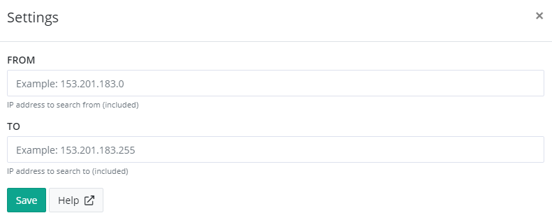

# Install IP Filter App for elmah.io

!!! warning
    The IP Filter app is deprecated. The *IP Filter* filter on the *Filters* tab offers more advanced IP filtering.

The IP Filter app for elmah.io automatically ignores messages from one or more IP addresses. This is a great way to ignore errors generated by both crawlers and errors generated by you.

To install IP Filter, click the Install button on the Apps tab. This will show the IP Filter settings page:

To ignore messages from a single IP address, input the IP in both the _From_ and _To_ fields. To ignore messages from a range of IP addresses, input the start and end IP address in the _From_ and _To_ fields. Both IP addresses are included in the ignored range.

The IP Filter app ignores every message matching the specified IP range. This means that if you are logging something like Information messages through Serilog or similar, these messages are also ignored. For a message to have an IP, you will need to specify a server variable named `REMOTE_ADDR` when creating the message. This variable is automatically added (if available) when using the integration for ELMAH.