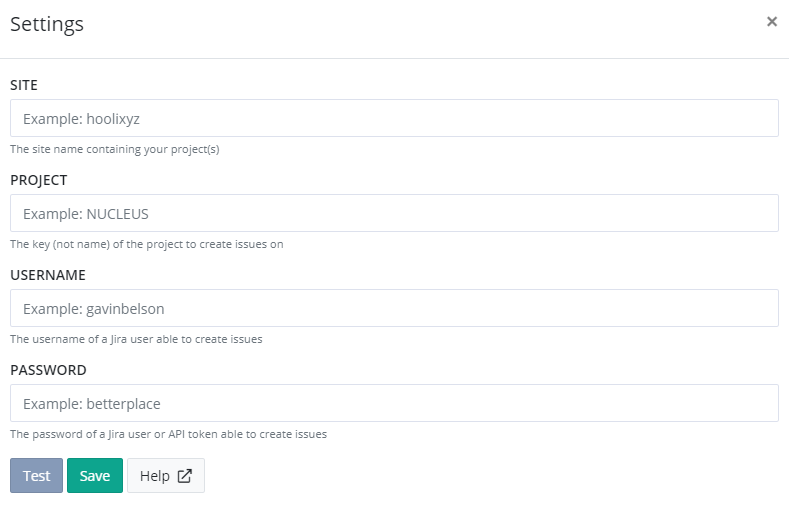

# Install Jira App for elmah.io

Log into elmah.io and go to the log settings. Click the Apps tab. Locate the Jira app and click the *Install* button:



Input your site name which is the first part of the URL you use to log into Jira. For the URL `https://elmahio.atlassian.net/`, the `site` parameter would be `elmahio`. In the Project field, input the key of the project. Note that a project have both a display name and a key. The property we are looking for here, is the uppercase identifier of the project.

To create issues on Jira, you will need to input the username and password of a user with permission to create issues in the project specified above. You can use your own user credentials, but we recommend generating a user specific to elmah.io. The username must be the one found on your Jira profile. Replace `YOURSITE` with your site name in the following URL: `https://YOURSITE.atlassian.net/secure/ViewProfile.jspa`.

Click *Save* and the app is added to your log. When new errors are logged, issues are automatically created in the configured Jira project.