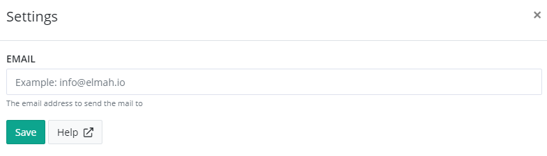

# Install Mailman App for elmah.io

> The Mailman app is deprecated. Use an email rule available on the *Rules* tab for more a more advanced email integration.

The Mailman app for elmah.io sends out an email to an address of your choice, every time a new error is logged.

To install Mailman, click the Install button on the Apps tab. This will show the Mailman settings page:

Input a valid email address in the _Email_ input box and click _Save_.

The Mailman app will look at new errors only. Errors are defined by messages with a severity of `Error` or `Fatal` and with `isNew == true`. `isNew` is a field automatically added by elmah.io when indexing each message. `isNew` is calculated by looking for similarities between the new message and already logged messages.