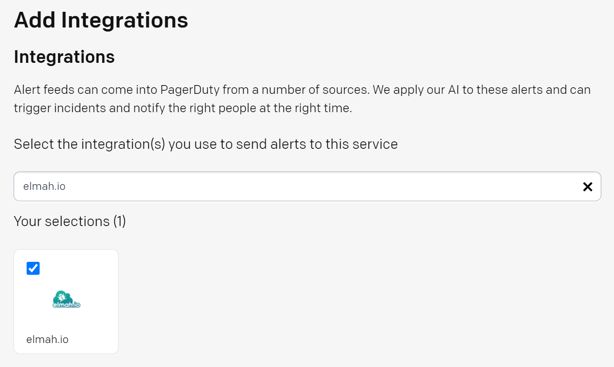
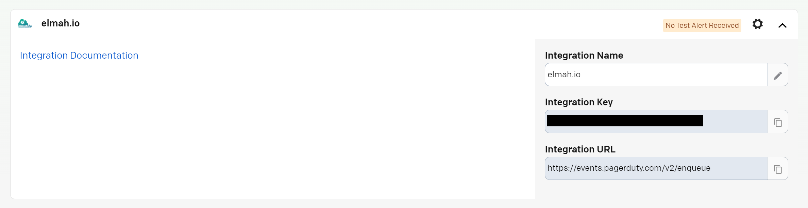
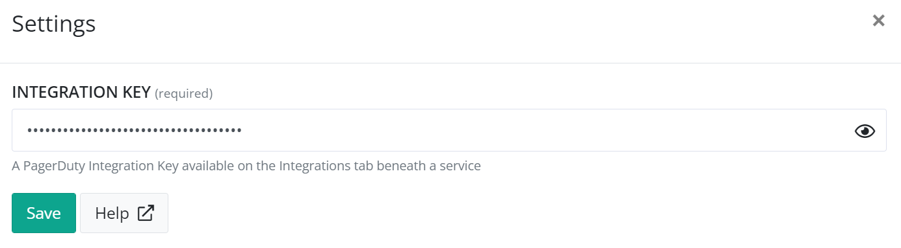

# Install PagerDuty for elmah.io

Using the PagerDuty integration for elmah.io, you can set up advanced notification rules in PagerDuty when new errors are logged on elmah.io. Receive a phone call, text message, or one of the other options provided by PagerDuty, the second new errors are introduced on your websites or services.

To integrate elmah.io with PagerDuty, you need to set up a new integration on PagerDuty and install the PagerDuty app on elmah.io.

## Setting up an integration on PagerDuty

-  Sign in to PagerDuty.

- Navigate to the *Services* page.

- Select the service that you want to integrate to from elmah.io in the list of services.

- On the *Integrations* tab click the *Add an integration* button.

- On the *Add Integrations* page search for elmah.io and select it in the search result:

- Click the *Add* button.

- Expand the newly created integration:

- Copy the value in the *Integration Key* field.

## Install the PagerDuty app on elmah.io

Next, the PagerDuty app needs to be installed on elmah.io.

- Sign in to elmah.io.

- Navigate to the *Log Settings* page of the log you want to integrate with PagerDuty.

- Go to the *Apps* tab.

- Locate the PagerDuty app and click the *Install* button.

- Input the Integration Key that you copied in a previous step in the *INTEGRATION KEY* field:

- Click the *Save* button.

That's it. New errors stored in the selected log now trigger incidents in PagerDuty. To get help with this integration, make sure to reach out through the support widget on the elmah.io website.