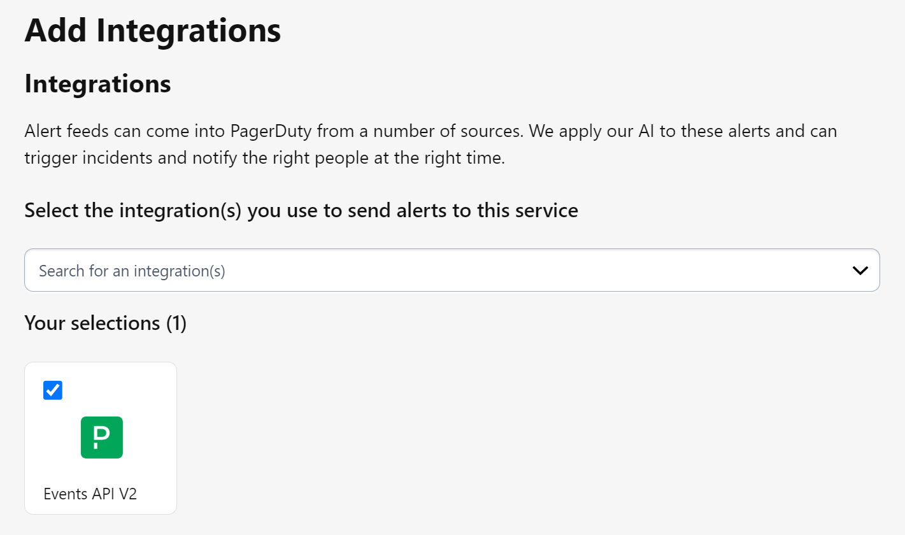
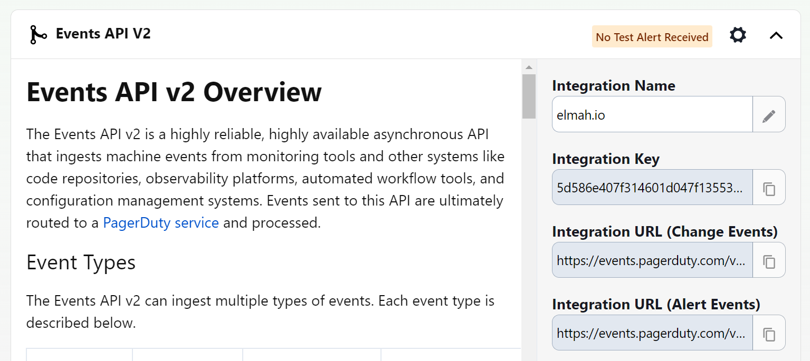

# Install PagerDuty for elmah.io

To integrate elmah.io with PagerDuty, you need to set up a new integration on PagerDuty and install the PagerDuty app on elmah.io.

## Setting up an integration on PagerDuty

-  Sign in to PagerDuty.

- Navigate to the *Services* page.

- Select the service that you want to integrate to from elmah.io in the list of services.

- On the *Integrations* tab click the *Add an integration* button.

- On the *Add Integrations* page select *Events API V2*:

- Click the *Add* button.

- Expand the newly created integration and give it a better name if you'd like:

- Copy the value in the *Integration Key* field.

## Install the PagerDuty app on elmah.io

Next, the PagerDuty app needs to be installed on elmah.io.

- Sign in to elmah.io.

- Navigate to the *Log Settings* page of the log you want to integrate with PagerDuty.

- Go to the *Apps* tab.

- Locate the PagerDuty app and click the *Install* button.

- Input the Integration Key that you copied in a previous step in the *INTEGRATION KEY* field:

- Click the *Save* button.

That's it. New errors stored in the selected log now trigger incidents in PagerDuty.