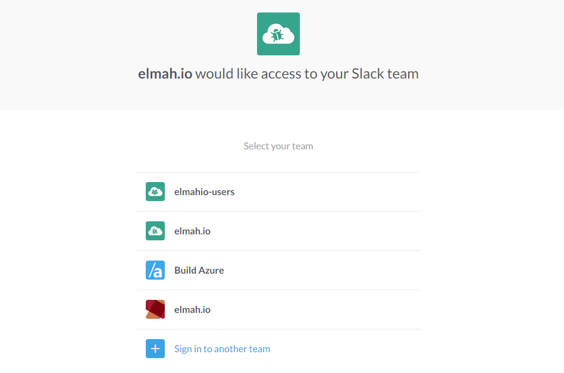
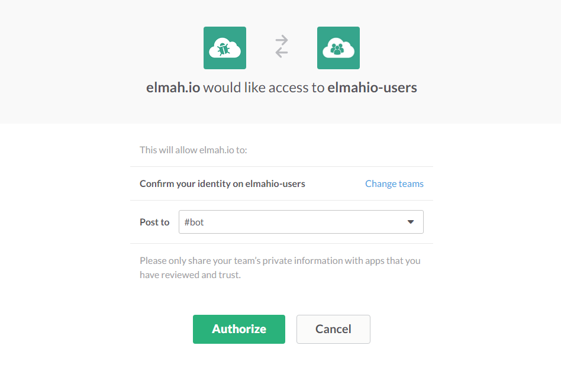

# Install Slack App for elmah.io

Log into elmah.io and go to the log settings. Click the Apps tab. Locate the Slack app and click the *Install* button. You will be asked to allow access from elmah.io:

Select your team and in the following screen, select the channel you want to show errors on Slack:

Click the _Authorize_ button and you will be redirected to elmah.io. The integration to Slack is now installed.

> Slack doesn't allow more than a single request per second. If you generate more than one message to elmah.io per second, not all of them will show up in Slack because of this.

## Troubleshooting

Errors don't show up in Slack. Here are a few things to try out.

* Make sure that the Slack app is installed on the log as described above.
* Only new errors are sent to Slack. New errors are marked with a yellow star on the search tab. We only sent new errors to help you stay out of Slack's API limits. If sending all errors, you could quickly end up in a scenario where the same error gets sent  multiple times and then more important errors gets ignored by Slack.
* Make sure that your token is still valid. The only way to resolve an issue where the token is no longer valid is to re-install the Slack app.