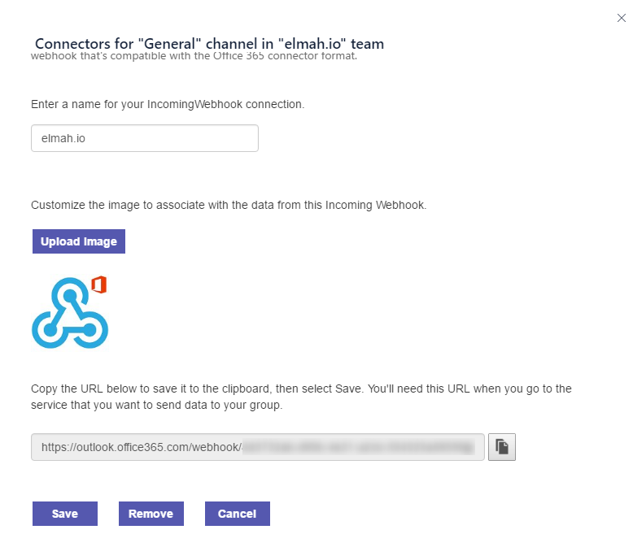
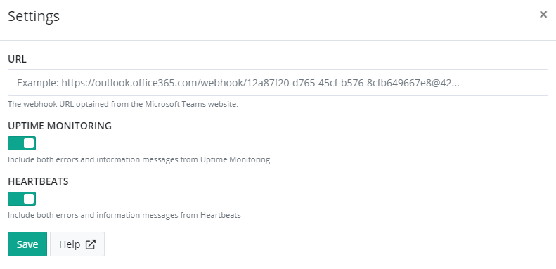

# Install Microsoft Teams App for elmah.io

## Install webhook connector on Microsoft Teams

In order to send messages to Microsoft Teams, you will need to install the Webhook connector on teams by clicking ... next to the channel you want for the elmah.io messages and click *Connectors*. Locate the *Incoming Webhook* and click *Add*. Input 'elmah.io' in the name text box and upload another image if you'd like. After clicking the *Create* button, you will see a webhook URL to use for the integration:



Copy the URL.

## Install the Microsoft Teams App on elmah.io

Log into elmah.io and go to the log settings. Click the Apps tab. Locate the Microsoft Teams app and click the *Install* button. In the overlay, paste the URL from the previous step:



Click *Save* and the app is added to your log. When new errors are logged, messages start appearing in the channel that you configured.

> The Office 365 API used behind the scenes for this app uses throttling rather than a maximum of allowed requests. This means that you may start experiencing messages not being sent, if you start logging a large amount of messages. We have experienced a lot of weird error codes when communicating with the API. An example of this is an exception while posting data to the API, but the data is successfully shown on Teams. The result of this error is, that elmah.io retries the failing request multiple times, which causes the same message to be shown multiple times on Teams.