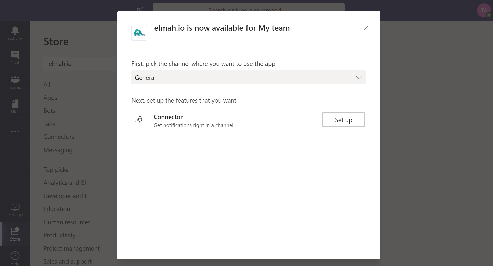

# Install Microsoft Teams App for elmah.io

To install the integration with Microsoft Teams, go to teams and click the *Store* menu item. Search for "elmah.io" and click the app:

Select your team and click the *Install* button:

Select which channel you want elmah.io messages in and click the *Set up* button:

A new webhook URL is generated. Click the *Copy Text* button followed by the *Save* button:

The elmah.io integration is now configured on Microsoft Teams and you should see the following screen:

The final step is to input the webhook URL that you just copied, into elmah.io.

Log into elmah.io and go to the log settings. Click the Apps tab. Locate the Microsoft Teams app and click the *Install* button. In the overlay, paste the URL from the previous step:

Click *Save* and the app is added to your log. When new errors are logged, messages start appearing in the channel that you configured.

> The Office 365 API used behind the scenes for this app uses throttling rather than a maximum of allowed requests. This means that you may start experiencing messages not being sent, if you start logging a large amount of messages. We have experienced a lot of weird error codes when communicating with the API. An example of this is an exception while posting data to the API, but the data is successfully shown on Teams. The result of this error is, that elmah.io retries the failing request multiple times, which causes the same message to be shown multiple times on Teams.