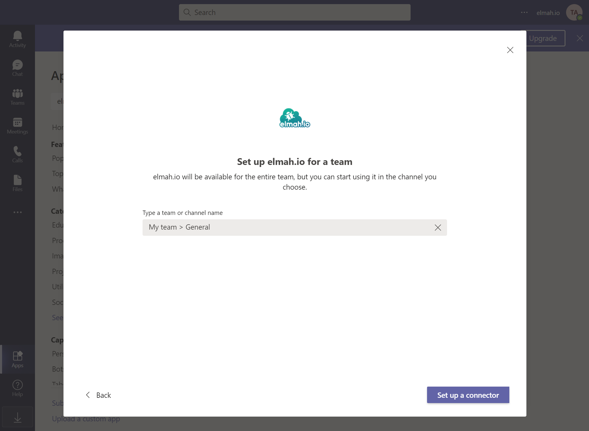

# Install Microsoft Teams App for elmah.io

[TOC]

## Teams v2

To install the integration with Microsoft Teams v2, go to teams and click the ⋯ menu item next to the channel you want elmah.io to post messages to. Then click the *Workflows* menu item:

{:style="width:100%;max-width:300px;margin-left:0;"}

In the *Workflows* dialog search for 'webhook' and select the *Post to a channel when a webhook request is received* template:

In the following step, Microsoft Teams will generate a name and validate the connection. You can input another name if you'd like but make sure that a green checkmark is shown. Click the *Next* button:

In the final step of setting up the webhook, make sure that the correct team and channel is selected. Then click the *Add workflow* button:

The workflow is successfully added. Copy the generated webhook URL and click the *Done* button:

The final step is to input the webhook URL that you just copied, into elmah.io.

Log into elmah.io and go to the log settings. Click the Apps tab. Locate the Microsoft Teams v2 app and click the *Install* button. In the overlay, paste the URL from the previous step:

Click *Save* and the app is added to your log. When new errors are logged, messages start appearing in the channel that you configured.

## Teams v1

To install the integration with Microsoft Teams, go to teams and click the *Apps* menu item. Search for "elmah.io" and click the app:

Click the *Add to a team* button. In the dropdown, search for your team and/or channel:

Click the *Set up a connector* button.

A new webhook URL is generated. Click the *Copy Text* button followed by the *Save* button:

The elmah.io integration is now configured on Microsoft Teams and you should see the following screen:

The final step is to input the webhook URL that you just copied, into elmah.io.

Log into elmah.io and go to the log settings. Click the Apps tab. Locate the Microsoft Teams app and click the *Install* button. In the overlay, paste the URL from the previous step:

Click *Save* and the app is added to your log. When new errors are logged, messages start appearing in the channel that you configured.

!!! note
    The Office 365 API used behind the scenes for this app uses throttling rather than a maximum of allowed requests. This means that you may start experiencing messages not being sent, if you start logging a large amount of messages. We have experienced a lot of weird error codes when communicating with the API. An example of this is an exception while posting data to the API, but the data is successfully shown on Teams. The result of this error is, that elmah.io retries the failing request multiple times, which causes the same message to be shown multiple times on Teams.

## Microsoft Teams Troubleshooting

Errors don't show up in Teams. Here are a few things to try out.

* Make sure that the Teams app is installed on the log as described above.
* Only new errors are sent to Teams. A new error has a severity of `Error` or `Fatal` and is marked with a yellow star on the search tab. We only send new errors to help you stay out of Teams' API limits. If sending all errors, you could quickly end up in a scenario where the same error is sent multiple times and more important errors get ignored by Teams.
* Re-install the app on elmah.io with the webhook URL provided by Teams.
* Remove the elmah.io configuration from Teams and re-install it. After re-installing the app, you will need to copy the new webhook URL provided by Teams and input it in the elmah.io Teams app as descrived above.
* Go to the Apps page on Teams and search for 'elmah.io'. Remove the app entirely, click F5 to refresh the page, and install the app again. You may be stuck on an older version of our app, which can be fixed by simply removing and installing the app again.