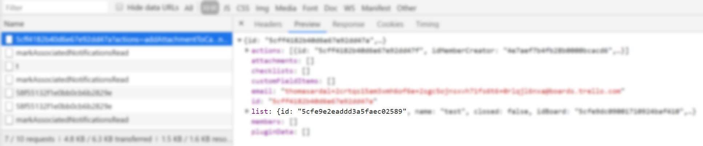
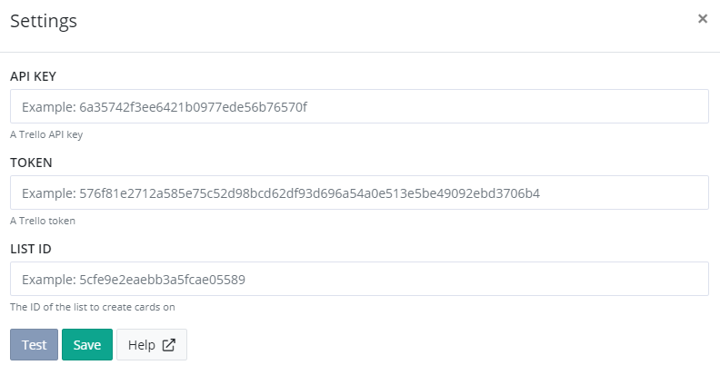

# Install Trello App for elmah.io

For elmah.io to communicate with the Trello API, we will need an API key and token. The API key is available here: `https://trello.com/app-key`. If you don't have a personal token available on that site, create a new Power-Up as described on the page. When the Power-Up is created, you can create a new API key on that page.

To get the token, visit the following URL in your browser: `https://trello.com/1/authorize?expiration=never&scope=read,write,account&response_type=token&name=Server%20Token&key=API_KEY`. Remember to replace `API_KEY` with your Trello API key located in the previous step. When clicking the *Allow* button, Trello will generate a new token for you and show it in the browser window.

elmah.io will create cards on a board list of your choice. Unfortunately, Trello didn't provide a way to obtain list IDs. The easiest way is to open Developer Tools in your browser and click an existing card inside the list you want elmah.io to create new cards in. Locate the request for the card details in the *Network* tab and click the *Preview* tab. The list id is in the card details:



Log into elmah.io and go to the log settings. Click the Apps tab. Locate the Trello app and click the *Install* button:



Input the API key, token, and list ID, all located in the previous steps. Click the *Test* button to test that everything works and finally, click *Save*. New errors now trigger elmah.io to create a card with the details of the error in Trello.

## Troubleshooting

If errors aren't showing up in Trello, please check that the following are all true:

- When clicking the *Test* button on the Trello app settings screen, the button turns green.
- There's a message logged in the log where you set up the Trello integration.
- The message is marked as new (yellow start next to the title on the search result).
- The message is either of severity `Error` or `Fatal`.

To trigger an error manually, go to [https://api.elmah.io/swagger/index.html](https://api.elmah.io/swagger/index.html) and input an elmah.io API key with the *Messages* - *Write* permission enabled. Expand *Messages* and the *POST* node with the URL `/v3/messages/{logId}`. Input your log ID and the following JSON:

```json
{
  "title": "This is a test",
  "severity": "Error"
}
```

Finally, click the *Try it out!* button and verify that the API returns a status code of *201*. The new error should show up in Trello. If testing this multiple times, you will need to make small adjustments to the title field inside the JSON, for additional errors to be marked as new.