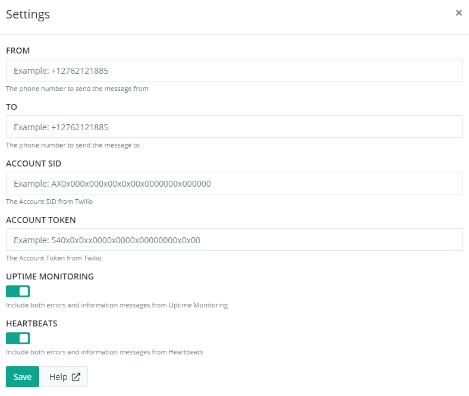

# Install Twilio for elmah.io

To send SMS/Text messages with Twilio, you will need to sign up for Twilio first. Twilio provides a range of good tutorials when signing up, why we don't want to duplicate them here. When signed up, you will have access to a Twilio phone number to send messages from, an Account SID and a token needed to authenticate Twilio. These pieces of information will be used below when installing the Twilio app on elmah.io.

Log into elmah.io and go to the log settings. Click the Apps tab. Locate the Twilio app and click the *Install* button:



Input your Twilio phone number (available on https://www.twilio.com/console/phone-numbers/incoming) in the *From* field. Input the phone number you want receiving error reports from elmah.io in the *To* field. Remember to fully qualify the number with a plus and the language code (US example: +12025550170 - UK example: +441632960775). Copy your *Account SID* and *Auth Token* from the Twilio Dashboard and input them in the fields on elmah.io.

Click *Save* and the app is added to your log. When new errors are logged, an SMS/Text message is automatically sent to the configured phone number.

## Twilio Troubleshooting

If errors aren't being sent to your phone, verify that the configured variables work. To do so, replace the four variables in the top of this PowerShell script and execute it:

```ps
$sid = "INSERT_SID"
$token = "INSERT_TOKEN"
$from = "INSERT_FROM"
$to = "INSERT_TO"

$url = "https://api.twilio.com/2010-04-01/Accounts/$sid/Messages.json"  

$pair = "$($sid):$($token)"
$encodedCreds = [System.Convert]::ToBase64String([System.Text.Encoding]::ASCII.GetBytes($pair))
$basicAuthValue = "Basic $encodedCreds"
$Headers = @{
    Authorization = $basicAuthValue
    ContentType = "application/x-www-form-urlencoded"
}

$from = $from.Replace("+", "%2B")
$to = $to.Replace("+", "%2B")

$response = Invoke-WebRequest -Uri $url -Method POST -Headers $Headers -Body "Body=Affirmative&From=$from&To=$to"
```

You should see a text message on your phone. The script will output any errors from Twilio if something isn't working.