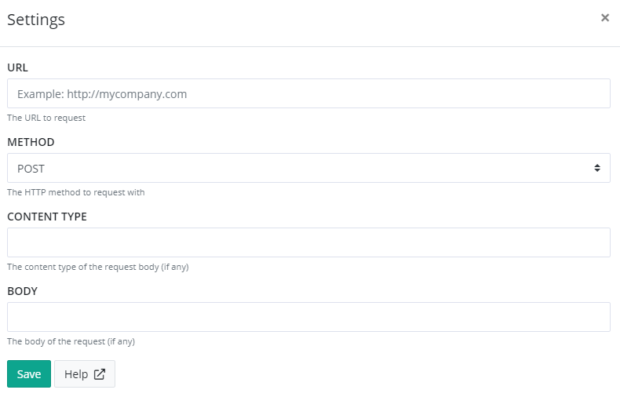

# Install WebClient App for elmah.io

> The WebClient app is deprecated. Use a HTTP rule available on the *Rules* tab for more a more advanced web integrations.

The WebClient app integrates elmah.io with every system providing a HTTP based API.

To install WebClient, click the Install button on the Apps tab. This will show the WebClient settings page:

Input a valid URL plus body and content type (if required). Finally hit _Save_.

The WebClient will make a HTTP request on the inputted URL every time a new message is logged. Be aware that this can potentially be **a lot** of requests, since everything from verbose to fatal message will trigger the HTTP request. Most services (like Slack and HipChat) only allow for a maximum number of requests per minute.