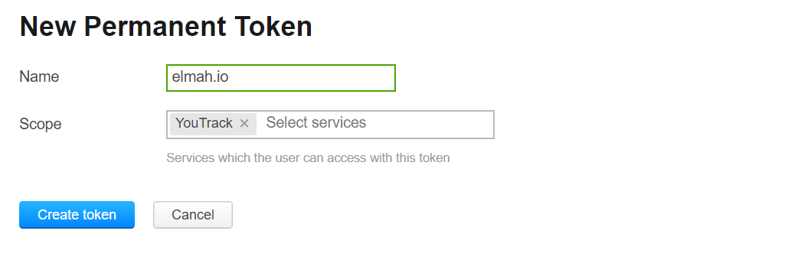
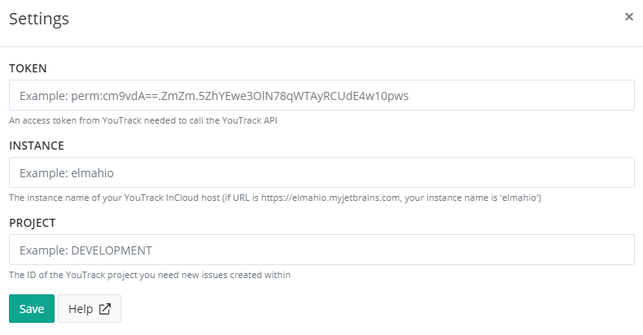

# Install YouTrack App for elmah.io

## Get your token

To allow elmah.io to create issues on YouTrack, you will need a permanent token. Go to your [profile](https://elmahio.myjetbrains.com/youtrack/users/me), click the _Update personal information and manage logins_ link and select the _Authentication_ tab. Here you can generate a new token:

Copy the generated token.

## Install the YouTrack App on elmah.io

Log into elmah.io and go to the log settings. Click the Apps tab. Locate the YouTrack app and click the *Install* button. Input your instance, project, and token from the previous step:

Click *Save* and the app is added to your log. When new errors are logged, issues are automatically created in the configured YouTrack project.