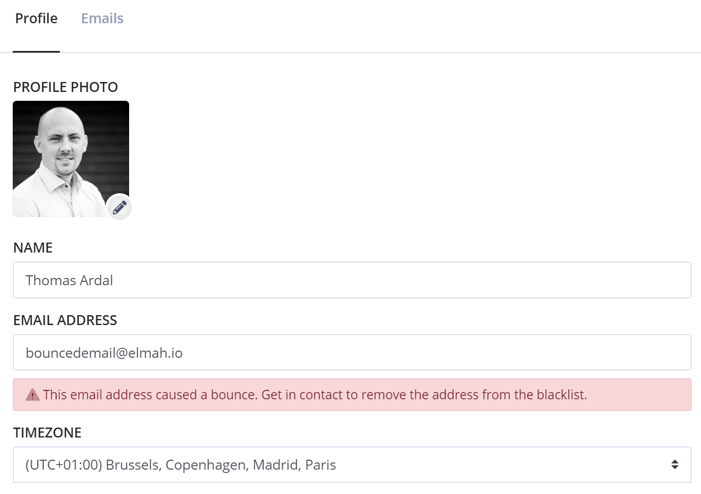

# Email troubleshooting

[TOC]

So, you aren't receiving emails from elmah.io? Here is a collection of things to know/try out.

## Emails on new errors only

The most common reason for not receiving emails when errors are logged is that elmah.io only sends the New Error email when an error that we haven't seen before is logged. New errors are marked with a yellow star next to the log message in the UI and can be searched through either search filters or full-text search:

```
isNew:true
```

The new detection algorithm is implemented by looking at a range of fields like the title, type, and severity. Only severities `Error` and `Fatal` marked as `isNew` trigger an email.

## Email bounced

We use AWS to send out all transactional emails from elmah.io. We get a notification from AWS when an email bounces and show an error message on your profile:



As the error message says, get in contact for us to try and reach the email address again.

An organization administrator can check the bounce status for all users in the organization by navigating to the *Users* tab on the Organization Settings page. Bounced emails will be marked with a yellow warning next to any bounced emails.

## Invalid email

Ok, this may seem obvious. But this happens more often than you would think. Typos are a common cause of invalid emails. Specifying a mailing list or group address doesn't always play nice with elmah.io either. For instance, Office 365 distribution groups block external emails as the default. The easiest way to check your inputted email address is to send a new message to that address from an external email provider.

## Check your promotional and/or spam folder

We do a lot to keep our email reputation high. However, some email clients may treat similar-looking emails as promotional or spam. Remember to check those folders and mark messages as important if spotting them in the wrong folder.