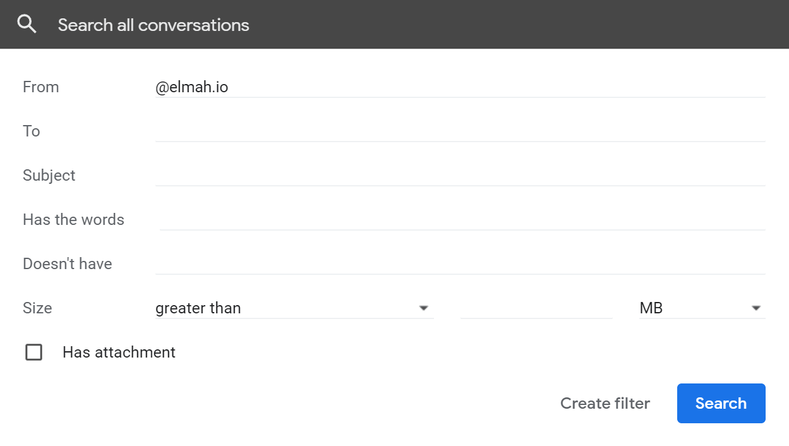
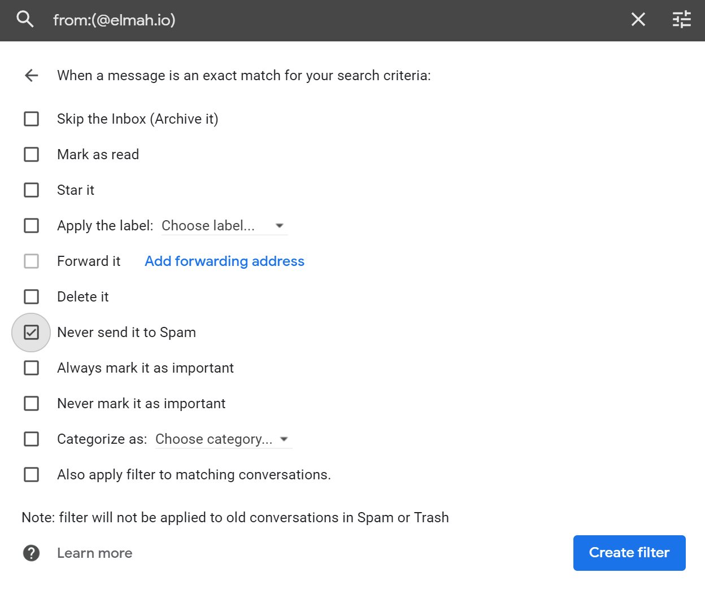

# How to avoid emails getting classified as spam

We do everything in our power to maintain a good email domain reputation. Sometimes emails sent from elmah.io may be classified in your email client. To avoid this, the easiest way is to inspect the sender in an email received from @elmah.io and add it to your contact list. We primarily send emails from `info@elmah.io` and `noreply@elmah.io`. How you do this depends on which email client you are using but all major clients have this option. In the sections below, there are alternatives to the contact list approach for various email clients.

## Gmail

If you don't want to add elmah.io addresses to your contact list you can use Gmail's Filters feature to always classify `*@elmah.io` as not spam. To do so, go to *Settings* | *Filters* and create a new filter:

Click *Create filter* and check the *Never send it to Spam* option:

Finally, click the *Create filter* button, and emails from elmah.io will no longer be classified as spam.