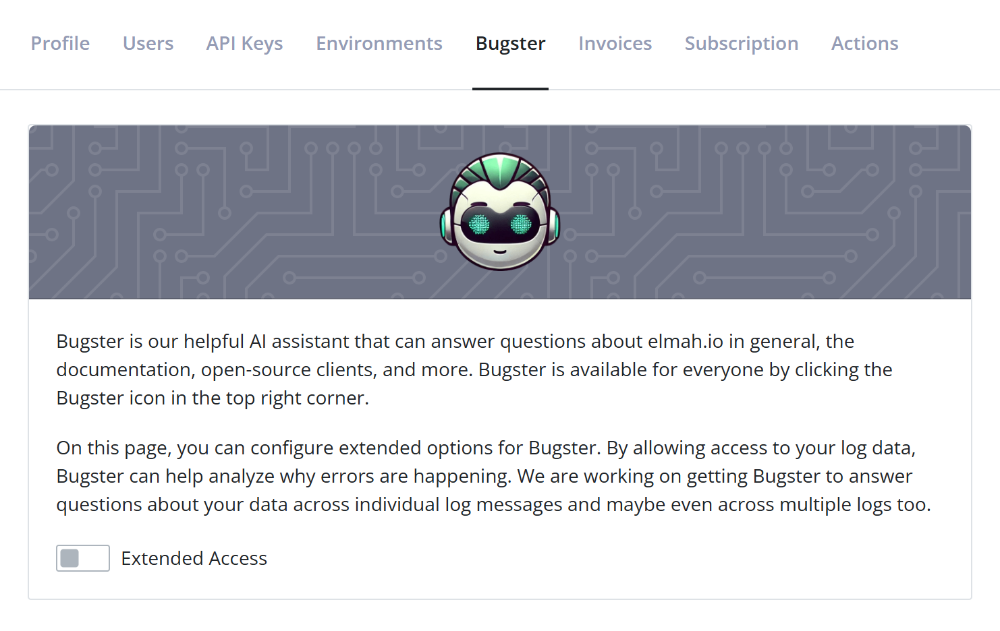
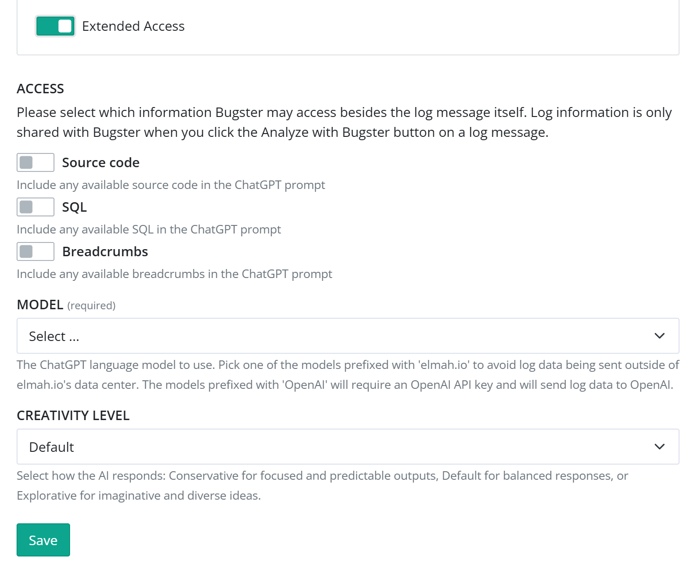
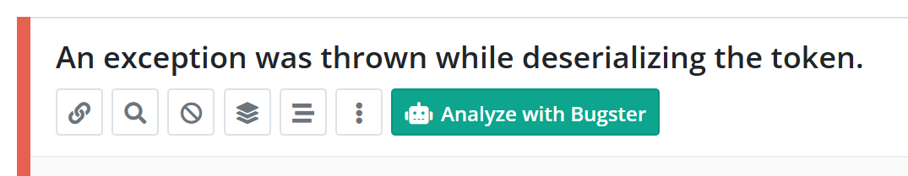

# How to configure and use Bugster

Bugster is the name of our friendly AI-powered bot. Bugster is currently available on this documentation site, as well as inside the elmah.io application. Depending on the context where you communicate with Bugster, it can answer different kind of questions. All users will have Bugster available, to answer general questions about elmah.io, the documentation, and more not related to any log data.

In this help article, you will learn how to configure Bugster to be used on log data. This way, you can get help analyzing why errors are happening and how to fix them, directly in the elmah.io app.

> We don't use your log data to train Bugster. Log data is currently only shared with Bugster when clicking the *Analyze with Bugster* button. In case you are using an OpenAI hosted model, your log data may be used to train OpenAI's models, unless you manually disable this in settings. More about that later in this article.

## Configuration

Out of the box, Bugster is available in the top right corner of the elmah.io application. Here, you can ask general elmah.io questions like known from this documentation site. To give Bugster access to your log data, navigate to the *Bugster* tab on the organization settings page. To open organization settings, click the gears icon next to your organization name on either the left menu or through the dashboard:

As shown from the screenshot, *Extended Access*, which is required for Bugster to access your log data, is disabled as default. When enabling the *Extended Access* toggle, various settings can be configured:

When *Extended Access* is enabled, Bugster will have access to messages in your logs. Basic information like the log message, severity, stack trace, etc. are included in this access. Using the toggles in the *ACCESS* section, you can include more information, as long as part of each log message like source code and breadcrumbs.

These toggles are currently used when you click the *Analyze with Bugster* button on the log message details:

When clicking this button, the Bugster chat window will show up, with Bugster's analysis of why this error happened and what you can do to fix it. Depending on your choices in the *ACCESS* section of the configuration, more or less log message details will be shared, with the potential of improving the answer.

On the Bugster configuration, you also need to pick a model. Extended Bugster is currently available on the Business, Business+, and Enterprise plans. Business and Business+ users need to provide their own OpenAI API key, while Enterprise users can chose between an OpenAI API key, and a model hosted by us. By picking an elmah.io hosted model, you make sure that log data does'nt leave our data center, while the OpenAI hosted models, will send log data to OpenAI. In the later case, we recommend to disable the *Improve the model for everyone* in the settings of your OpenAI profile to avoid log data being used for training.