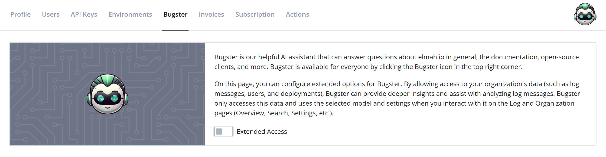
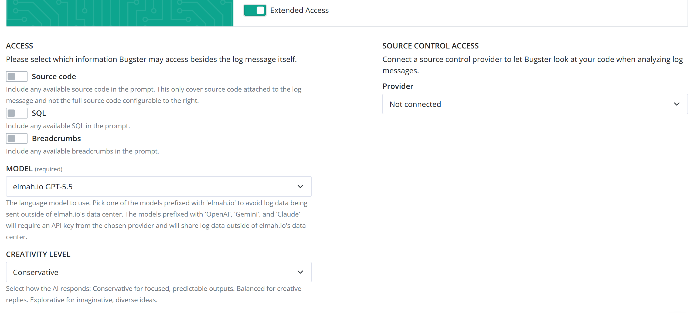
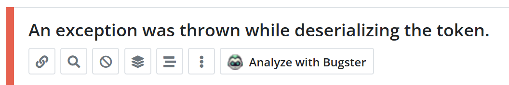

# How to configure and use Bugster

[TOC]

Bugster is the name of our friendly AI-powered bot. Bugster is currently available on this documentation site, as well as inside the elmah.io application. Depending on the context in which you communicate with Bugster, it can answer different kinds of questions. All users will have Bugster available to answer general questions about elmah.io, the documentation, and other topics not related to log data.

In this help article, you will learn how to configure Bugster to be used on log data. This way, you can get help analyzing why errors are happening and how to fix them, directly in the elmah.io app.

!!! note
    We don't use your log data to train Bugster. Log data is currently only shared with Bugster when clicking the *Analyze with Bugster* button or when asking Bugster about log data specifically. In case you are using a model not prefixed with *elmah.io*, your log data may be used to train the chosen provider's model, unless you manually disable this in settings. More about that later in this article.

Out of the box, Bugster is available in the top right corner of the elmah.io application. Here, you can ask general elmah.io questions, as known from this documentation site. To give Bugster access to your log data, navigate to the *Bugster* tab on the organization settings page. To open organization settings, click the gears icon next to your organization name on either the left menu or through the dashboard:

As shown in the screenshot, *Extended Access*, which is required for Bugster to access your log data, is disabled by default. When enabling the *Extended Access* toggle, various settings can be configured:

When *Extended Access* is enabled, Bugster will have access to messages in your logs. Basic information like the log message, severity, stack trace, etc., is included in this access. Using the toggles in the *ACCESS* section, you can include more information like source code and breadcrumbs.

Your log messages can attach a few lines of code (see [How to include source code in log messages](how-to-include-source-code-in-log-messages.md)). If you want to give Bugster full access to your source code repository, this can be configured in the *SOURCE CONTROL ACCESS* section. Currently, GitHub and Azure DevOps is supported. To learn how to set this up, jump directly to [Give Bugster access to your source code](#give-bugster-access-to-your-source-code).

The access toggles and source control settings, are currently used when you click the *Analyze with Bugster* button on the log message details:

When clicking this button, the Bugster chat window will show up, with Bugster's analysis of why this error happened and what you can do to fix it. Depending on your choices in the configuration, more or fewer log message details will be shared, with the potential of improving the answer. You can also ask general questions about your log data by launching Bugster on the Log Search page.

On the Bugster configuration, you also need to pick a model. Extended Bugster is currently available on the Business, Business+, and Enterprise plans. Business and Business+ users need to provide their own OpenAI, Gemini or Claude API key, while Enterprise users can choose between both an external model and a model hosted by us. By picking an elmah.io-hosted model, you make sure that log data doesn't leave our data center, while the external models will send log data to the chosen provider. In the latter case, we recommend disabling *Improve the model for everyone* on OpenAI, disabling *Gemini Apps Activity* on Gemini, or disabling *Help improve Claude* on Claude, to avoid log data being used for training.

## Give Bugster access to your source code

The *SOURCE CONTROL ACCESS* section on the Bugster settings page lets Bugster look directly at your repository code when analyzing a log message, rather than relying only on the small code snippet attached to the message itself.

To set it up:

1. Under *Provider*, select either *GitHub* or *AzureDevOps*, depending on where your source code is hosted.
2. In the *Token* field, paste a personal access token (PAT) for the selected provider, with permission to read code in your repositories. A GitHub PAT and an Azure DevOps PAT are not interchangeable, so make sure the token matches the provider you picked. The token needs the following permissions:
    - **GitHub** (fine-grained PAT): Repository permissions → *Contents: Read-only*. *Metadata: Read-only* is required as well, but GitHub adds this automatically. If you use a classic PAT instead, grant the *repo* scope (or *public_repo* if you only need access to public repositories).
    - **Azure DevOps**: the *Code (Read)* scope, to list repositories, branches, and file contents, plus the *Project and Team (Read)* scope, which is needed to list projects when testing the connection.
3. In the *Owner*/*Organization* field, enter:
    - Your GitHub user or organization login, if you selected *GitHub*.
    - The name of your Azure DevOps organization, if you selected *AzureDevOps*.
4. Click *Test connection* to verify that elmah.io can reach your repositories with the provided token and owner/organization. The button turns green with *Success* if the connection works, or red with *Fail* if it doesn't. A failed test usually means the token, owner/organization, or selected provider doesn't match (for example, pasting a GitHub token while *AzureDevOps* is selected as the provider).
5. Click *Save* to store the settings.

Connecting a source control provider on organization settings makes the connection available to all logs in the organization, but Bugster doesn't know which repository belongs to which log until you tell it. This is configured per log, on the *Bugster* tab of that log's settings page.

1. If you connected *AzureDevOps*, first pick a *Project*. This step is skipped for *GitHub*, since GitHub repositories aren't grouped under a project.
2. Pick a *Repository*. The list is fetched live from your source control provider, using the token configured on organization settings.
3. Optionally pick a *Branch*. Leave this as *None* to use the repository's default branch.
4. Click *Save*.

Select *None* for the repository at any time to stop sharing code for that specific log - the org-level source control connection stays in place and can still be used by other logs.