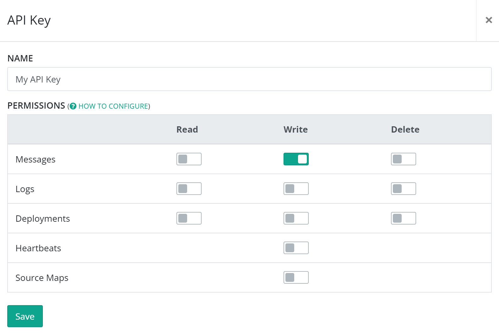

# How to configure API key permissions
Security on the elmah.io API is handled through the use of API keys. All requests to the API must be accompanied by an API key. When creating your organization, a default API key was automatically created. API keys can be revoked and you can create multiple API keys for different purposes and projects. Much like a user can be awarded different levels of access on elmah.io, API keys also have a set of permissions. The default created API key for your organization, only have permission to write log messages to elmah.io.

To configure permissions for a new or existing API key, either click the `Edit` or `Add API Key` button on the API Keys tab of your organization settings. This will show the API key editor view:

As mentioned previously, new keys have the `messages_write` permission enabled only. This permission will cover logging from your application to elmah.io. If your application needs to browse messages from elmah.io, create new logs/applications, etc. you will need to enable the corresponding permission. Notice that read permissions don't need to be enabled, for you to browse logs and log messages on the elmah.io UI. API keys are used by the range of client integrations only.

!!! warning
    Your API key shouldn't be shared outside your organization. In some situations, you will need to share your API key (like when logging from JavaScript). In these cases, it's essential that your API key only has the `messages_write` permission enabled. With all permissions enabled, everyone will be able to browse your logs.