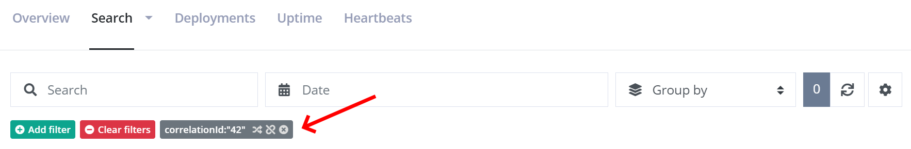

# How to correlate messages across services

[TOC]

> The Correlations feature is currently in beta.

A common architecture is to spread out code across multiple services. Some developers like to split up their code into microservices. Others have requirements for running code asynchronous behind a queue. The common theme here is that code often runs in multiple processes spread across multiple servers. While logging can be easily set up in different projects and services, being able to correlate log messages across multiple services isn't normally available when logging to individual log outputs.

Imagine a console application making an HTTP request to your public API. The API calls an internal API, which again puts a message on a queue. A service consumes messages from the queue and ends up logging an error in the error log. Seeing the entire log trace from receiving the request on the API straight down the chain resulting in the error, highly increases the chance of figuring out what went wrong. With the Correlation feature on elmah.io, we want to help you achieve just that. In this article, you will learn how to set up Correlations.

> Correlation currently requires all of your applications to log to the same log on elmah.io. For you to separate log messages from each service, we recommend setting the `Application` property on all log messages. Filtering on log messages is available through the elmah.io UI. We may want to explore ways to use Correlation across multiple error logs in the future.

## CorrelationId explained

The way log messages are correlated on elmah.io is based on a property on all log messages named `correlationId`. The field is available both when creating log messages through our API as well as in the `Elmah.Io.Client` NuGet package. The property is a string which means that you can use whatever schema you want for the correlation ID.

To set the correlation ID using the client, use the following code:

```csharp
var myCorrelationId = "42";
var client = ElmahioAPI.Create("API_KEY");
await client.Messages.CreateAndNotifyAsync(new Guid("LOG_ID"), new CreateMessage
{
    Title = "Hello World",
    // ...
    CorrelationId = myCorrelationId
});
```

In a real-world scenario, `myCorrelationId` wouldn't be hardcoded but pulled from a shared header, message ID, or similar. As long as all services set `CorrelationId` to the same ID, log messages within a correlation can be searched on the elmah.io UI:



## Setting CorrelationId

How you set the correlation ID depends on which integration you are using. In some cases, a correlation ID is set automatically while others will require a few lines of code.

### ASP.NET Core

When logging uncaught errors using the `Elmah.Io.AspNetCore` package, we automatically pick up any active activity and put the trace ID as part of the error logged to elmah.io. For an overview of wrapping calls to your ASP.NET Core API in an `Activity` check out the section about W3C Trace Context.

If you want to set the correlation ID manually, you can use the `OnMessage` action:

```csharp
public void ConfigureServices(IServiceCollection services)
{
    // ...
    services.Configure<ElmahIoOptions>(o =>
    {
        o.OnMessage = msg =>
        {
            msg.CorrelationId = "42";
        };
    });
    // ...
}
```

### Microsoft.Extensions.Logging

To store a correlation ID when logging through Microsoft.Extensions.Logging you can either set the `CorrelationId` property manually or rely on the automatic behavior built into Microsoft.Extensions.Logging.

To manually set the correlation you can either include `correlationId` as part of the log message:

```csharp
logger.LogInformation("A log message with {correlationId}", "42");
```

Or you can put the correlation ID as part of a logging scope:

```csharp
using (logger.BeginScope(new { CorrelationId = "42" }))
{
    logger.LogInformation("A log message");
}
```

In some cases, a correlation ID will be set automatically. If there is a current active `Activity` (see later), Microsoft.Extensions.Logging automatically decorates all log messages with a custom property name `TraceId`. The elmah.io backend will pick up any value in the `TraceId` and use that as the correlation ID.

### Serilog

When logging through Serilog a correlation ID can be added to one or more log messages in multiple ways. The most obvious being on the log message itself:

```csharp
Log.Information("A log message with {correlationId}", "42");
```

If you don't want correlation ID as part of the log message, you can push the property using `LogContext`:

```csharp
using (LogContext.PushProperty("correlationId", "42"))
{
    Log.Information("A log message");
}
```

You will need to install the `LogContext` enricher for this to work:

```csharp
Log.Logger =
    new LoggerConfiguration()
        .Enrich.FromLogContext()
        // ...
        .CreateLogger();
```

### NLog

Correlation ID can be set on log messages logged through NLog in multiple ways. The first approach is to include the ID directly in the log message:

```csharp
logger.Info("A log message with {correlationId}", "42");
```

If you don't want the ID as part of the log message you can use either NLog's two context objects:

```csharp
using (MappedDiagnosticsLogicalContext.SetScoped("correlationId", "42"))
{
    logger.Info("A log message");
}
GlobalDiagnosticsContext.Set("correlationId", "42");
```

You can also add the property manually to the log message using the log event builder API available in NLog:

```csharp
var infoMessage = new LogEventInfo(LogLevel.Info, "", "A log message");
infoMessage.Properties.Add("correlationid", "42");
logger.Info(infoMessage);
```

### log4net

Correlation ID can be set on log messages logged through log4net in multiple ways. You can include it directly on the `LoggingEvent`:

```csharp
var properties = new PropertiesDictionary();
properties["correlationid"] = "42";
log.Logger.Log(new LoggingEvent(new LoggingEventData
{
    Level = Level.Info,
    TimeStampUtc = DateTime.UtcNow,
    Properties = properties,
    Message = "A log message",
}));
```

You most likely use the `Info`, `Warn`, and similar helper methods to store log messages. In this case, you can set the correlation ID on the `ThreadContext`:

```csharp
ThreadContext.Properties["correlationid"] = "42";
log.Info("A log message");
```

Please notice that `correlationid` in both examples must be in all lowercase.

## W3C Trace Context

The class `Activity` has been mentioned a couple of times already. Let's take a look at what that is and how it relates to W3C Trace Context. Trace Context is a specification by W3C for implementing distributed tracing across multiple processes which are already widely adopted. If you generate a trace identifier in a client initiating a chain of events, different Microsoft technologies like ASP.NET Core already pick up the extended set of headers and include those as part of log messages logged through Microsoft.Extensions.Logging.

Let's say we have a console application calling an API and we want to log messages in both the console app and in the API and correlate them in elmah.io. In both the console app and in the ASP.NET Core application, you would set up `Elmah.Io.Extensions.Logging` using the default configuration. Then in the console application, you will wrap the call to the API in an `Activity`:

```csharp
var httpClient = new HttpClient();
var activity = new Activity("ApiCall").Start();
try
{
    using (logger.BeginScope(new
    {
        TraceId = activity.TraceId,
        ParentId = activity.ParentSpanId,
        SpanId = activity.SpanId }))
    {
        logger.LogInformation("Fetching data from the API");
        var result = await httpClient.GetStreamAsync("https://localhost:44396/ping");
        // ...
    }
}
finally
{
    activity.Stop();
}
```

By creating and starting a new `Activity` before we call the API, log messages in the console app can be decorated with three additional properties: `TraceId`, `ParentId`, and `SpanId`. This will make sure that all log messages logged within this scope will get the correlation ID set on elmah.io. `HttpClient` automatically picks up the activity and decorates the request with additional headers.

On the API we simply log as normal:

```csharp
[ApiController]
[Route("[controller]")]
public class PingController : ControllerBase
{
    private readonly ILogger<PingController> _logger;

    public PingController(ILogger<PingController> logger)
    {
        _logger = logger;
    }

    [HttpGet]
    public string Get()
    {
        _logger.LogInformation("Received a ping");
        return "pong";
    }
}
```

Notice that we didn't have to decorate log messages with additional properties. ASP.NET Core automatically picks up the new headers and decorates all log messages with the correct trace ID.