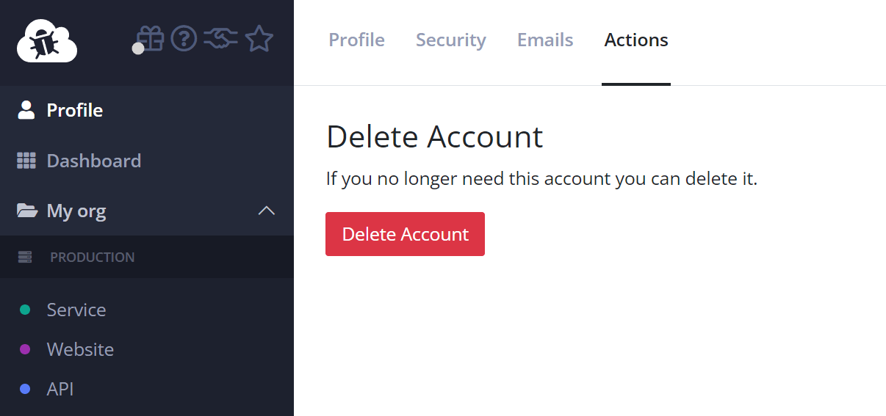

# How to delete my account

In case you no longer need your user account you can delete it. There are two different ways of doing that:

1. Remove it from any paid organization and let it auto-delete one year after the last login.
2. Remove it manually through the elmah.io UI.

User accounts are automatically cleaned up when no longer used. You will receive an email one month before we delete your account to give you a chance to keep it.

If you want to delete your account immediately, go to your profile and click the *Actions* tab:

When clicking the *Delete Account* button your user account will be deleted and you will be signed out of elmah.io. You can sign up for a new account using the same email if you want a new account.

> Deleted accounts cannot be restored. We hard delete to avoid keeping personal data longer than we have to.

To delete a user account your user may not be part of any organization. Either delete any organizations shown in the left menu or ask an organization administrator to remove your user from the organization. Once the user is no longer part of any organization, it can be deleted.