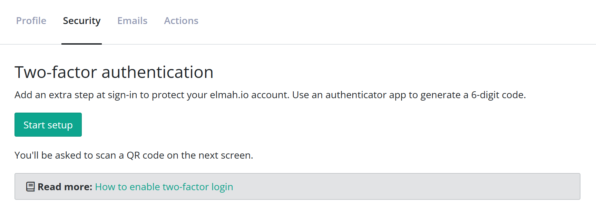
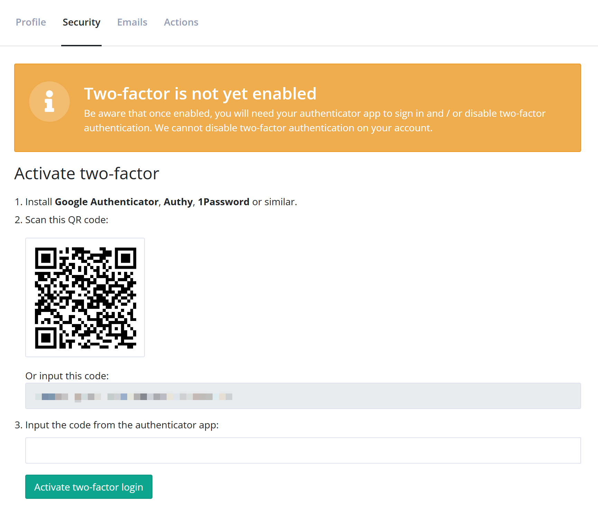
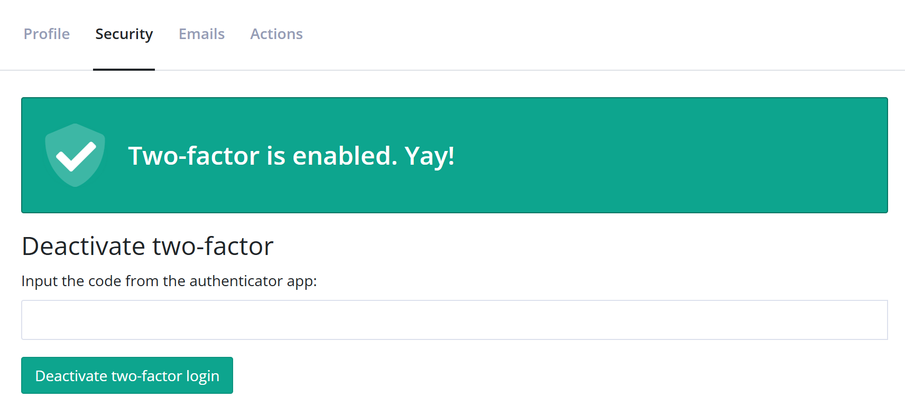

# How to enable two-factor login

[TOC]

elmah.io supports two-factor login through either one of the social providers or a two-factor app like 1Password, Google Authenticator or Authy.

## Two-factor with an elmah.io username and password

When signing into elmah.io with a username and password, two-factor authentication can be enabled on the Security tab on your profile:

Click the *Start setup* button to initiate the process:

Follow the instructions on the page to install an app like 1Password, Google Authenticator or Authy. Once you have the app installed, scan the on-screen QR code and input the generated token in the field in step 3.

Once two-factor authentication has been successfully set up, the following screen is shown:

Two-factor authentication can be disabled at any time by inputting a new code from the authenticator app in the text field and clicking the *Deactivate two-factor login* button.

!!! tip
    Popular authenticator apps like Google Authenticator and Microsoft Authenticator support cloud backup. Make sure to enable this in case you lose your phone. When cloud backup is enabled, you can sign in with your main account when you get a new phone and all of your stored accounts will be automatically restored.

## Two-factor with a social provider

When using one of the social providers to log in to elmah.io, two-factor authentication can be enabled through either Twitter, Facebook, Microsoft, or Google. Check out the documentation for each authentication mechanism for details on how to enable two-factor authentication.

## Troubleshooting

**When I input a code from the app, elmah.io says that it is invalid**

There can be a couple of reasons for that:

- A code can only be used once, so if you recently signed in using a code, you cannot use the same code to deactivate 2FA or similar.
- You are using an old account in your authenticator app. When setting up 2FA, you will need to scan the code again and create a new account in the authenticator app. Previous elmah.io accounts added to the app cannot be used, even though they share the same email address.
- The code is indeed invalid or changed since you copied it. Double-check the code and try again.